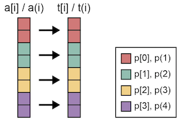
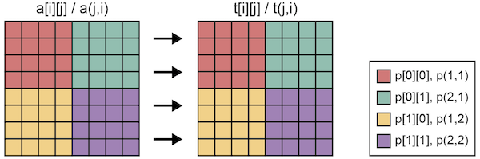
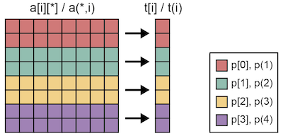
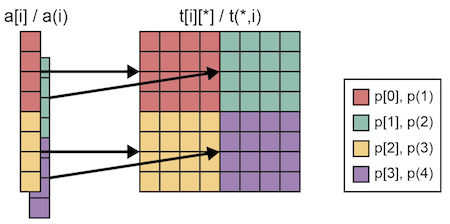

=================================
align directive
=================================

The align directive performs data mapping and distributes data among nodes by using a distributed template.
The align directive should be given after the target array definition.

.. contents::
   :local:
   :depth: 2

Normal alignment
----------------

* XMP/C program

.. code-block:: C

    #pragma xmp nodes p[4]
    #pragma xmp template t[8]
    #pragma xmp	distribute t[block] onto p
    int a[8];
    #pragma xmp align a[i] with t[i]

* XMP/Fortran program

.. code-block:: Fortran

    !$xmp nodes p(4)
    !$xmp template t(8)
    !$xmp distribute t(block) onto p
    integer :: a(8)
    !$xmp align a(i) with t(i)

The align directive aligns the owner node of a[i] with t(i), a distributed template.
As a result, array a is distributed among the node set p.

The align directive also can be used for multi-dimensional arrays.

* XMP/C program

.. code-block:: C

    #pragma xmp	nodes p[2][2]
    #pragma xmp	template t[8][8]
    #pragma xmp distribute t[block][block] onto p
    int a[8][8];
    #pragma xmp align a[i][j] with t[i][j]

* XMP/Fortran program

.. code-block:: Fortran

    !$xmp nodes p(2,2)
    !$xmp template t(8,8)
    !$xmp distribute t(block,block) onto p
    integer :: a(8,8)
    !$xmp align a(j,i) with t(j,i)

Special alignment
-----------------
Collapse
^^^^^^^^
The user can align a 2-dimensional array with a 1-dimensional template.

* XMP/C program

.. code-block:: C

    #pragma xmp nodes p[4]
    #pragma xmp template t[8]
    #pragma xmp distribute t[block] onto p
    int a[8][8];
    #pragma xmp align a[i][*] with t[i]

* XMP/Fortran program

.. code-block:: Fortran

    !$xmp nodes p(4)
    !$xmp template t(8)
    !$xmp distribute t(block) onto p
    integer :: a(8,8)
    !$xmp align a(*,i) with t(i)

When an asterisk symbol is given in the array reference in the align directive,
the specified dimension is not distributed among the node set.
In the sample program, the first dimension of the array a is distributed among node set p
while the second dimension is duplicated.

In XMP/C, a[0:2][:] will be allocated on p[0].
Likewise, a(:,1:2) will be allocated on p(1) in XMP/Fortran.

Replicate
^^^^^^^^^^
The use also can align an 1-dimensional array with a multi-dimensional template.

* XMP/C program

.. code-block:: C

    #pragma xmp nodes p[2][2]
    #pragma xmp template t[8][8]
    #pragma xmp distribute t[block][block] onto p
    int a[8];
    #pragma xmp align a[i] with t[i][*]

* XMP/Fortran program

.. code-block:: Fortran

    !$xmp nodes p(2,2)
    !$xmp template t(8,8)
    !$xmp distribute t(block,block) onto p
    integer :: a(8)
    !$xmp align a(i) with t(*,i)

When an asterisk symbol is given in the template reference in the align directive,
the owner nodes of the specified dimension will have duplicated elements of the target array.

In XMP/C, a[0:4] will be duplicated and allocated on p[0][0] and p[0][1].
Likewise, a(1:4) will be allocated on p(1,1) and p(2,1) in XMP/Fortran.
