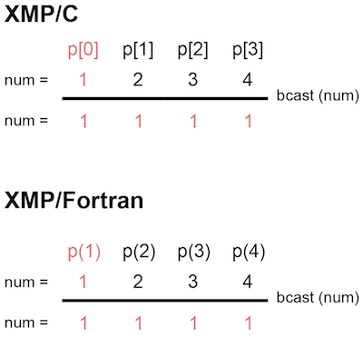
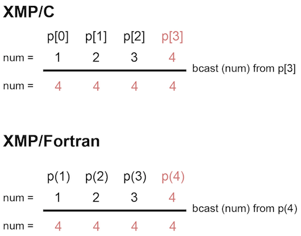
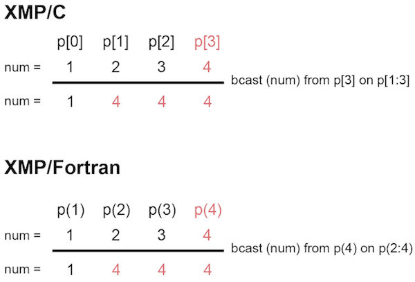

=================================
bcast construct
=================================

The bcast directive broadcasts variables which are held by the node, specified in the from clause, to the node set specified in the on clause.
If there is no from clause, the first node of the target node set is the starting point.
If there is no on clause, the current set of nodes will be covered.

In the below example, the first node of the node set p is the starting point.

* XMP/C program

.. code-block:: C

   #pragma xmp nodes p[4]
     :
   num = xmpc_node_num() + 1;
   #pragma xmp bcast (num)

* XMP/Fortran program

.. code-block:: Fortran

    !$xmp nodes p(4)
      :
    num = xmp_node_num()
    !$xmp bcast (num)

In the below example, starting from the last node of node set p by the from clause.

* XMP/C program

.. code-block:: C

   #pragma xmp nodes p[4]
     :
   num = xmpc_node_num() + 1;
   #pragma xmp bcast (num) from p[3]

* XMP/Fortran program

.. code-block:: Fortran

    !$xmp nodes p(4)
      :
    num = xmp_node_num()
    !$xmp bcast (num) from p(4)

In the below example, only the values of the last three nodes in 4 nodes are target for communication by the on clause.

* XMP/C program

.. code-block:: C

   #pragma xmp nodes p[4]
     :
   sum = xmpc_node_num() + 1;
   #pragma xmp bcast (num) from p[3] on p[1:3]

* XMP/Fortran program

.. code-block:: Fortran

   !$xmp nodes p(4)
     :
    sum = xmp_node_num()
    !$xmp bcast (num) from p(4) on p(2:4)

