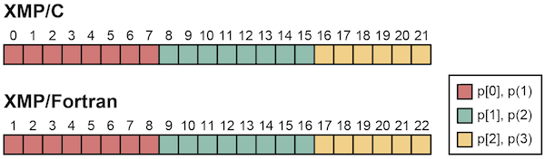
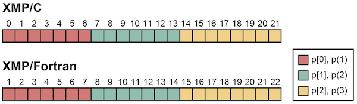
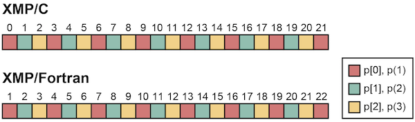
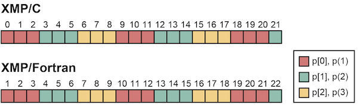
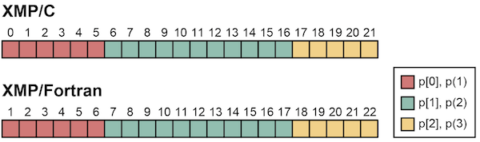
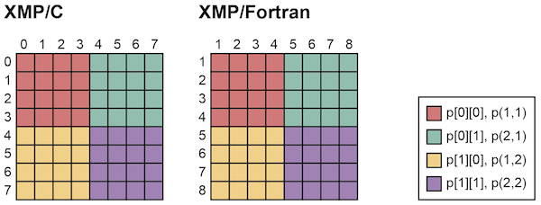
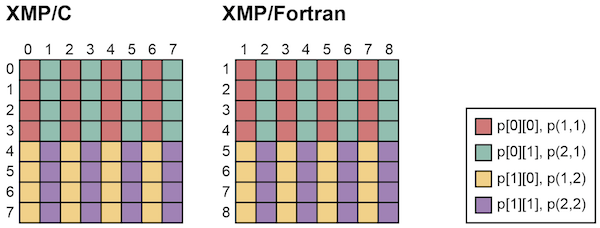
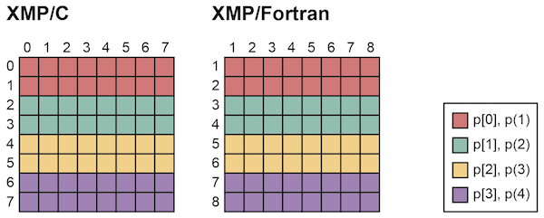

=================================
distribute directive
=================================

The distribute directive specifies a distribution of the target template.
The user can specify block, cyclic, block-cyclic, gblock (irregular data distribution) distribution, which can be chosen by the target application.

.. contents::
   :local:
   :depth: 2

block Distribution
----------

* XMP/C program

.. code-block:: C

   #pragma xmp distribute t[block] onto p

* XMP/Fortran program

.. code-block:: Fortran

   !$xmp distribute t(block) onto p

Target data is divided into contiguous blocks and distributed among nodes.
When the size of the template is N and the number of nodes is K, the chunk size of each block will be ceil(N/K).
For example, block distribution is useful for stencil computation which refers to neighborhood elements.

.. note:: 

   Function ceil(x) returns the minimum integer value which is greater than x.

* XMP/C program

.. code-block:: C

   #pragma xmp nodes p[3]
   #pragma xmp template t[22]
   #pragma xmp distribute t[block] onto p

* XMP/Fortran program

.. code-block:: Fortran

   !$xmp nodes p(3)
   !$xmp template t(22)
   !$xmp distribute t(block) onto p

Since ceil(22/3) is 8, 8 elements will be allocated on p[0] and p[1].
And then, 6 elements will be allocated on p[2].

The user can specify the size of the block chunk explicitly.
In that case, the remaining elements will be allocated on the last node.

* XMP/C program

.. code-block:: C

   #pragma xmp nodes p[3]
   #pragma xmp template t[22]
   #pragma xmp distribute t[block(7)] onto p

* XMP/Fortran program

.. code-block:: Fortran

   !$xmp nodes p(3)
   !$xmp template t(22)
   !$xmp distribute t(block(7)) onto p

7 elements will be allocated on the p[0] and p[1], as specified in the directive.
And then remaining 8 elements will be allocated on the last node p[2].

cyclic Distribution
----------

* XMP/C program

.. code-block:: C

   #pragma xmp distribute t[cyclic] onto p

* XMP/Fortran program

.. code-block:: Fortran

   !$xmp distribute t(cyclic) onto p

Target data is divided into a chunk of a single element and distributed among nodes in a round-robin manner.
Cyclic distribution is suitable for computation with irregular load balance of data and computation.

* XMP/C program

.. code-block:: C

   #pragma xmp nodes p[3]
   #pragma xmp template t[22]
   #pragma xmp distribute t[cyclic] onto p

* XMP/Fortran program

.. code-block:: Fortran

   !$xmp nodes p(3)
   !$xmp template t(22)
   !$xmp distribute t(cyclic) onto p

block-cyclic Distribution
-------------------

* XMP/C program

.. code-block:: C

   #pragma xmp distribute t[cyclic(w)] onto p

* XMP/Fortran program

.. code-block:: Fortran

   !$xmp distribute t(cyclic(w)) onto p

Target data is divided into a contiguous block of size w and distributed among nodes in a round-robin manner.
Block-cyclic distribution is suitable for computation which has irregular load balance
and references to neighborhood elements.

* XMP/C program

.. code-block:: C

   #pragma xmp nodes p[3]
   #pragma xmp template t[22]
   #pragma xmp distribute t[cyclic(3)] onto p

* XMP/Fortran program

.. code-block:: Fortran

   !$xmp nodes p(3)
   !$xmp template t(22)
   !$xmp distribute t(cyclic(3)) onto p

gblock Distribution
-----------

* XMP/C program

.. code-block:: C

   #pragma xmp distribute t[gblock(W)] onto p

* XMP/Fortran program

.. code-block:: Fortran

   !$xmp distribute t(gblock(W)) onto p

Array W is a mapping array which is used for irregular data distribution. 
W[k]/W(k) elements will be allocated on node p(k).
The user can specify special type of data distribution explicitly by using mapping arrays (e.g. distribution of triangular matrix).

* XMP/C program

.. code-block:: C

   #pragma xmp nodes p[3]
   #pragma xmp template t[22]
   int W[3] = {6, 11, 5};
   #pragma xmp distribute t[gblock(W)] onto p

* XMP/Fortran program.

.. code-block:: Fortran

   !$xmp nodes p(3)
   !$xmp template t(22)
   integer, parameter :: W(3) = (/6,11,5/)
   !$xmp distribute t(gblock(W)) onto p

The user can specify an asterisk symbol instead of a mapping array in gblock.
In that case, data distribution will be determined at runtime by using :doc:`template_fix`.

Distribution of Multi-dimensional templates
--------------------------
The user can distribute multi-dimensional templates with a (single/multi-dimensional) node set.

* XMP/C program

.. code-block:: C

   #pragma xmp nodes p[2][2]
   #pragma xmp template t[10][10]
   #pragma xmp distribute t[block][block] onto p

* XMP/Fortran program

.. code-block:: Fortran

   !$xmp nodes p(2,2)
   !$xmp template t(10,10)
   !$xmp distribute t(block,block) onto p

The distribute directive declares data distribution of a 2-dimensional template by using a 2-dimensional node set.
Each dimension of the template is divided by block distribution on node set p.

The user can specify different distribution pattern to each dimension.

* XMP/C program

.. code-block:: C

   #pragma xmp nodes p[2][2]
   #pragma xmp template t[10][10]
   #pragma xmp distribute t[block][cyclic] onto p

* XMP/Fortran program

.. code-block:: Fortran

   !$xmp nodes p(2,2)
   !$xmp template t(10,10)
   !$xmp distribute t(cyclic,block) onto p

When an asterisk symbol is given in the distribute directive instead of distribution type,
the target dimension will remain undistributed.
In the following example, the first dimension will be distributed (block distribution) and the second dimension will remain undistributed.

* XMP/C program

.. code-block:: C

   #pragma xmp nodes p[4]
   #pragma xmp template t[10][10]
   #pragma xmp distribute t[block][*] onto p

* XMP/Fortran program

.. code-block:: Fortran

   !$xmp nodes p(4)
   !$xmp template t(10,10)
   !$xmp distribute t(*,block) onto p

