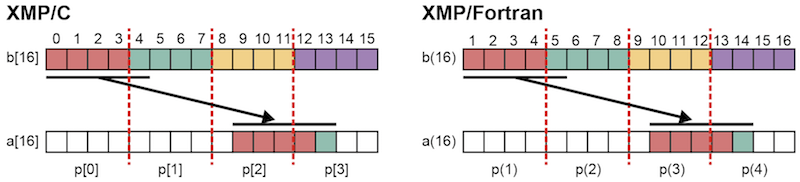
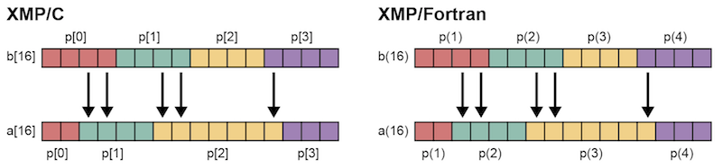
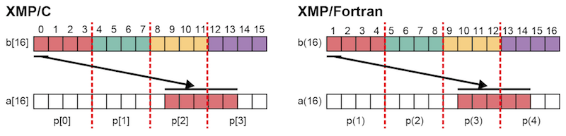
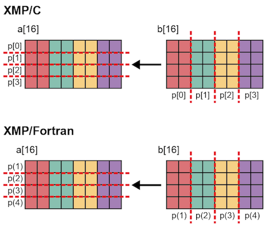
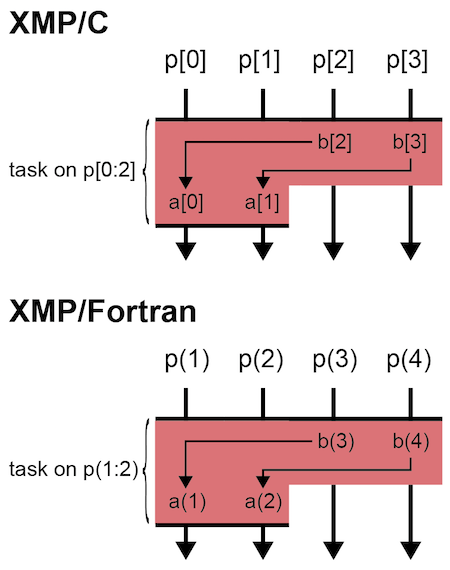
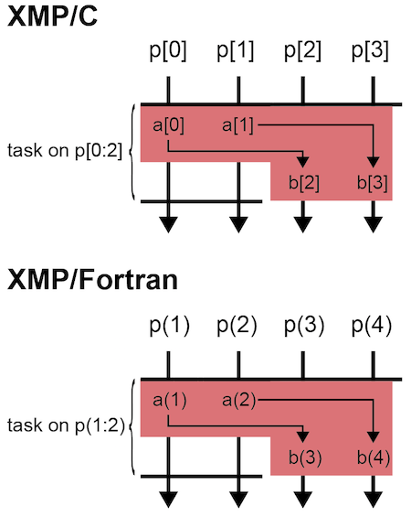

=================================
gmove construct
=================================

You can describe a communication for distributed arrays in the form of assignment statements by using gmove directive.

There are three modes in gmove; "collective mode", "in mode," and "out mode."
While collective mode executes two-sided communication among the executing nodes,
in/out modes execute one-sided communication among tasks with a task directive.
While in mode uses get communication, out mode uses put communication.

.. contents::
   :local:
   :depth: 2

Collective mode
------------------

Communications among distributed arrays
^^^^^^^^^^^^^^^^^^^
Copying a part of array a to array b.
Array assignment statements in a gmove construct uses triplet.

* XMP/C program

.. code-block:: C

    #pragma xmp nodes p[4]
    #pragma xmp template t[16]
    #pragma xmp distribute t[block] onto p
    int a[16], b[16];
    #pragma xmp align a[i] with t[i]
    #pragma xmp align b[i] with t[i]
         :
    #pragma xmp gmove
      a[9:5] = b[0:5];

* XMP/Fortran program

.. code-block:: Fortran

    !$xmp nodes p(4)
    !$xmp template t(16)
    !$xmp distribute t(block) onto p
    integer :: a(16), b(16)
    !$xmp align a(i) with t(i)
    !$xmp align b(i) with t(i)
         :
    !$xmp gmove
      a(10:14) = b(1:5)

In XMP/C, p[0] sends b[0] - b[3] to p[2] - p[3], and p[1] sends b[4] to p[3].
Similarly, in XMP/Fortran, p(1) sends b(1) - b(4) to p(3) - p(4), and p(2) sends b(5) to p(4).

In this example, it is assignment statements between distributed arrays with the same shape, but of couree it can be assign with the different shape.

* XMP/C program

.. code-block:: C

    #pragma xmp nodes p[4]
    #pragma xmp template t1[16]
    #pragma xmp template t2[16]
    #pragma xmp distribute t1[cyclic] onto p
    #pragma xmp distribute t2[block] onto p
    int a[16], b[16];
    #pragma xmp align a[i] with t1[i]
    #pragma xmp align b[i] with t2[i]
         :
    #pragma xmp gmove
      a[9:5] = b[0:5];

* XMP/Fortran program

.. code-block:: Fortran

    !$xmp nodes p(4)
    !$xmp template t1(16)
    !$xmp template t2(16)
    !$xmp distribute t1(cyclic) onto p
    !$xmp distribute t2(block) onto p
    integer :: a(16), b(16)
    !$xmp align a(i) with t1(i)
    !$xmp align b(i) with t2(i)
         :
    !$xmp gmove
      a(10:14) = b(1:5)

.. image:: ../img/gmove/gmove_cyclic.png

Array a is distributed according to cyclic, array b is distributed according to block.

In XMP/C, p[0] sends b[0] and b[4] to p[2] and p[3]. p[1] sends b[1] to p[2]. Each element of p[2] and p[3] will be local copied.
Similarly, in XMP/Fortran, p(1) sends b(1) and b(5) to p(3) and p(4). p(2) sends b(2) to p(3). Each element of p(3) and p(4) will be local copied.

.. note::
   
   If the number of elements specified on the right side is other than 1, it will not work properly if the number of elements differs between the right side and the left side.

By using this method, the shape of distributed array can be changed during calculation.

.. code-block:: C

    #pragma xmp nodes p[4]
    #pragma xmp template t1[16]
    #pragma xmp template t2[16]
    int W[4] = {2,4,8,2};
    #pragma xmp distribute t1[gblock(W)] onto p
    #pragma xmp distribute t2[block] onto p
    int a[16], b[16];
    #pragma xmp align a[i] with t1[i]
    #pragma xmp align b[i] with t2[i]
         :
    #pragma xmp gmove
      a[:] = b[:];

* XMP/Fortran program

.. code-block:: Fortran

    !$xmp nodes p(4)
    !$xmp template t1(16)
    !$xmp template t2(16)
    integer :: W(4) = (/2,4,7,3/)
    !$xmp distribute t1(gblock(W)) onto p
    !$xmp distribute t2(block) onto p
    integer :: a(16), b(16)
    !$xmp align a(i) with t1(i)
    !$xmp align b(i) with t2(i)
         :
    !$xmp gmove
      a(:) = b(:)

In this example, copying all elements of array b which is block distributed to array a which is gblock distributed.
In array a and b, communication occurs only for elements whose responsible nodes do not match (the arrow means communication between nodes in figures).

Communication of scalar
^^^^^^^^^^^^^^^
In an assignment statement, if one element is specified on the right side and plural elements are specified on the left side, the operation will be broadcast communication.

* XMP/C program

.. code-block:: C

    #pragma xmp nodes p[4]
    #pragma xmp template t[16]
    #pragma xmp distribute t[block] onto p
    int a[16], b[16];
    #pragma xmp align a[i] with t[i]
    #pragma xmp align b[i] with t[i]
         :
    #pragma xmp gmove
      a[9:5] = b[0];

* XMP/Fortran program

.. code-block:: Fortran

    !$xmp nodes p(4)
    !$xmp template t(16)
    !$xmp distribute t(block) onto p
    integer :: a(16), b(16)
    !$xmp align a(i) with t(i)
    !$xmp align b(i) with t(i)
         :
    !$xmp gmove
      a(10:14) = b(1)

In this example, in XMP/C, an element array b[0] of node p[0] will be broadcasted to specified index of node p[2] and p[3].
Similarly, in XMP/Fortran, an element array b(1) of node p(1) will be broadcasted to specified index of node p(3) and p(4).

Communication of duplicated array and scalar values
^^^^^^^^^^^^^^^^^^^^^^^^^^^^^^
Not only the distributed array but also the duplicate array and ordinary scalar variable can be described on the right side.

* XMP/C program (a port of it)

.. code-block:: C

    #pragma xmp nodes p[4]
    #pragma xmp template t[16]
    #pragma xmp distribute t[block] onto p
    int a[16], b[16], c;
    #pragma xmp align a[i] with t[i]
         :
   #pragma xmp gmove
      a[9:5] = b[0:5];

   #pragma xmp gmove
      a[9:5] = c;

* XMP/Fortran program

.. code-block:: Fortran

    !$xmp nodes p(4)
    !$xmp template t(16)
    !$xmp distribute t(block) onto p
    integer :: a(16), b(16), c
    !$xmp align a(i) with t(i)
         :
   !$xmp gmove
      a(10:14) = b(1:5)

   !$xmp gmove
      a(10:14) = c

In this example, duplicated array and scalar variable are local copied to distributed array.
For this reason, communication does not occur.

Communication between distributed arrays with different division dimensions
^^^^^^^^^^^^^^^^^^^^^^^^^^^^^^^^^^

* XMP/C program

.. code-block:: C

    #pragma xmp nodes p[4]
    #pragma xmp template t1[8]
    #pragma xmp template t2[16]
    #pragma xmp distribute t1[block] onto p
    #pragma xmp distribute t2[block] onto p
    int a[8][16], b[8][16];
    #pragma xmp align a[i][*] with t1[i]
    #pragma xmp align b[*][i] with t2[i]
         :
    #pragma xmp gmove
      a[0][:] = b[0][:];

* XMP/Fortran program

.. code-block:: Fortran

    !$xmp nodes p(4)
    !$xmp template t1(8)
    !$xmp template t2(16)
    !$xmp distribute t1(block) onto p
    !$xmp distribute t2(block) onto p
    integer :: a(16,8), b(8,16)
    !$xmp align a(*,i) with t1(i)
    !$xmp align b(i,*) with t2(i)
         :
    #pragma xmp gmove
      a(:,1) = b(:,1)

In this example, in XMP/C, b[0][0:2] of p[0], b[0][2:2] of p[1], b[0][4:2] of p[2] and b[0][6:2] of p[3] are copied to a[0][:] of p[0].
Similarly, in XMP/Fortran, b(1:2,1) of p(1), b(3:4,1) of p(2), b(5:6,1) of p(3) and b(7:8,1) of p(4) are copied to a(:,1) of p(1).

in mode
---------
It operates as in mode by setting in clause to gmove directive

* XMP/C program

.. code-block:: C

   #pragma xmp nodes p[4]
   #pragma xmp template t[4]
   #pragma xmp distribute t[block] onto p
   double a[4], b[4];
   #pragma xmp align a[i] with t[i]
   #pragma xmp align b[i] with t[i]
      :
   #pragma xmp task on p[0:2]
   #pragma xmp gmove in
     a[0:2] = b[2:2]
   #pragma xmp end task

* XMP/Fortran program

.. code-block:: Fortran

   !$xmp nodes p(4)
   !$xmp template t(4)
   !$xmp distribute t(block) onto p
   real :: a(4), b(4)
   !$xmp align a(i) with t(i)
   !$xmp align b(i) with t(i)
      :
   !$xmp task on p(1:2)
   !$xmp gmove in
     a(1:2) = b(3:4)
   !$xmp end task

In this example, the task directive divides the node set of 4 nodes into two nodes, the first half and the second half.
In gmove directive which is in mode, it executes Get communication from array of second half node to array of first half node.

out mode
-----------
It operates as out mode by setting out clause to gmove directive

* XMP/C program

.. code-block:: C

   #pragma xmp nodes p[4]
   #pragma xmp template t[4]
   #pragma xmp distribute t[block] onto p
   double a[4], b[4];
   #pragma xmp align a[i] with t[i]
   #pragma xmp align b[i] with t[i]
      :
   #pragma xmp task on p[0:2]
   #pragma xmp gmove out
     b[2:2] = a[0:2]
   #pragma xmp end task

* XMP/Fortran program

.. code-block:: Fortran

   !$xmp nodes p(4)
   !$xmp template t(4)
   !$xmp distribute t(block) onto p
   real :: a(4), b(4)
   !$xmp align a(i) with t(i)
   !$xmp align b(i) with t(i)
      :
   !$xmp task on p(1:2)
   !$xmp gmove out
     b(3:4) = a(1:2)
   !$xmp end task

In this example, it just reversed the assignment statement of the in mode.
In gmove directive which is out mode, it executes Put communication from array of first half node to array of second half node.

