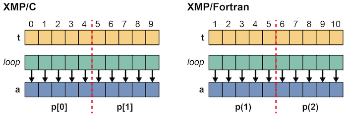
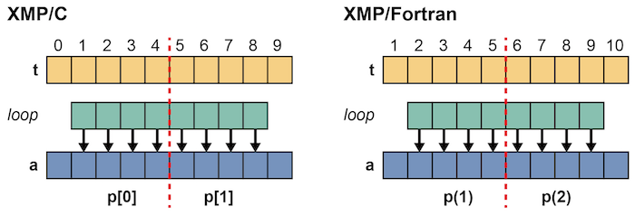
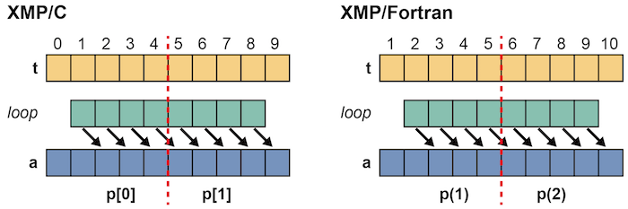
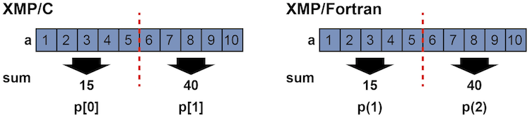
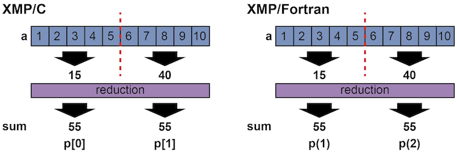

=================================
loop construct
=================================

The loop directive is used to parallelize a loop. Distributed arrays
in such a loop must fulfill the following two conditions:

1. There is no data/control dependence among the iterations.
   In other words, the iterations of the loop can be executed in any
   order to produce the same result.

2. An element of a distributed array is accessed only by the node that
   owns the element.

.. contents::
   :local:
   :depth: 2

Accessing Distributed Arrays
-------------------------------------
The programs below are examples of a right loop directive and a loop statement.
The condition 1. is satisfied because i is the only one index of the
distributed array a that is accessed within the loop, and the
condition 2 is also satisfied because the indices of the template in
the on clause of the loop directive is identical to that of the
distributed array.

* XMP/C program

.. code-block:: C

    #pragma xmp nodes p[2]
    #pragma xmp template t[10]
    #pragma xmp distribute t[block] onto p

    int main(){
      int a[10];
    #pragma xmp align a[i] with t[i]

    #pragma xmp loop on t[i]
      for(int i=0;i<10;i++)
        a[i] = i;

      return 0;
    }

* XMP/Fortran program

.. code-block:: Fortran

    program main
    !$xmp nodes p(2)
    !$xmp template t(10)
    !$xmp distribute t(block) onto p
      integer a(10)
    !$xmp align a(i) with t(i)

    !$xmp loop on t(i)
      do i=1, 10
        a(i) = i
      enddo

    end program main

Is it possible to parallelize the below loops whose bounds are shrunk?

* XMP/C program

.. code-block:: C

    #pragma xmp loop on t[i]
      for(int i=1;i<9;i++)
        a[i] = i;

* XMP/Fortran program

.. code-block:: Fortran

    !$xmp loop on t(i)
      do i=2, 9
        a(i) = i
      enddo

In this case, the conditions 1 and 2 are satisfied and therefore it is
possible to parallelize them.
In XMP/C, p[0] processes the indices from one to four and p[1] from five to eight.
In XMP/Fortran, p(1) processes the indices from two to five and p(2) from six to nine.

	   
Next, is it possible to parallelize the below loops in which the index
of the distributed array is different ?

* XMP/C program

.. code-block:: C

    #pragma xmp loop on t[i]
      for(int i=1;i<9;i++)
        a[i+1] = i;

* XMP/Fortran program

.. code-block:: Fortran

    !$xmp loop on t(i)
      do i=2, 9
        a(i+1) = i
      enddo

In this case, the condition 1 is satisfied but 2 is not, and therefore
it is not possible to parallelize them.
In XMP/C, p[0] tries to access a[5] but does not own it.
In XMP/Fortran, p(1) tries to access a(6) but does not own it.

Reduction Computations
---------

The serial programs below are examples of the reduction computation.

* C program

.. code-block:: C

    #include <stdio.h>
    
    int main(){
      int a[10], sum = 0;
    
      for(int i=0;i<10;i++){
        a[i] = i+1;
        sum += a[i];
      }
    
      printf("%d\n", sum);
    
      return 0;
    }

* Fortran program

.. code-block:: Fortran

    program main
      integer :: a(10), sum = 0
    
      do i=1, 10
        a(i) = i
        sum = sum + a(i)
      enddo

      write(*,*) sum

    end program main

If the above loops are parallelized only with the loop directive, the
value of the variable sum varies from node to node because it is
calculated on each node.

* XMP/C program

.. code-block:: C

   #pragma xmp loop on t[i]
      for(int i=0;i<10;i++){
        a[i] = i+1;
        sum += a[i];
      }

* XMP/Fortran program

.. code-block:: Fortran

    !$xmp loop on t(i)
      do i=1, 10
        a(i) = i
        sum = sum + a(i)
      enddo

Then, add the reduction clause to the loop directive.

* XMP/C program

.. code-block:: C

    #include <stdio.h>
    #pragma xmp nodes p[2]
    #pragma xmp template t[10]
    #pragma xmp distribute t[block] onto p

    int main(){
      int a[10], sum = 0;
    #pragma xmp align a[i] with t[i]

    #pragma xmp loop on t[i] reduction(+:sum)
      for(int i=0;i<10;i++){
        a[i] = i+1;
        sum += a[i];
      }

      printf("%d\n", sum);

      return 0;
    }

* XMP/Fortran program

.. code-block:: Fortran

    program main
    !$xmp nodes p(2)
    !$xmp template t(10)
    !$xmp distribute t(block) onto p
      integer :: a(10), sum = 0
    !$xmp align a(i) with t(i)

    !$xmp loop on t(i) reduction(+:sum)
      do i=1, 10
        a(i) = i
        sum = sum + a(i)
      enddo

      write(*,*) sum

    end program main

A operator and target variables for reduction are specified in a
reduction clause. In the above examples, a "+" operator is specified for
the reduction computation to produce a total sum among nodes.

Operations that can be used in a reduction computation are limited to
the following associative ones.

* XMP/C program

.. code-block:: bash

    +
    *
    -
    &
    |
    ^
    &&
    ||
    max
    min
    firstmax
    firstmin
    lastmax
    lastmin

* XMP/Fortran program

.. code-block:: bash

    +
    *
    -
    .and.
    .or.
    .eqv.
    .neqv.
    max
    min
    iand
    ior
    ieor
    firstmax
    firstmin
    lastmax
    lastmin

.. note::
   If the reduction variable is type of floating point, 
   the difference of the order of the executions can make a little bit
   difference between serial and parallel executions

Parallelizing nested loops
------------------------------
Parallelization of nested loops can be specified in a similar manner
for a single loop.

* XMP/C program

.. code-block:: C

    #pragma xmp nodes p[2][2]
    #pragma xmp template t[10][10]
    #pragma xmp distribute t[block][block] onto p

    int main(){
      int a[10][10];
    #pragma xmp align a[i][j] with t[i][j]

    #pragma xmp loop on t[i][j]
      for(int i=0;i<10;i++)
        for(int j=0;j<10;j++)
          a[i][j] = i*10+j;

      return 0;
    }

* XMP/Fortran program

.. code-block:: Fortran

    program main
    !$xmp nodes p(2,2)
    !$xmp template t(10,10)
    !$xmp distribute t(block,block) onto p
      integer :: a(10,10)
    !$xmp align a(j,i) with t(j,i)

    !$xmp loop on t(j,i)
      do i=1, 10
        do j=1, 10
          a(j,i) = i*10+j
        enddo
      enddo

    end program main
