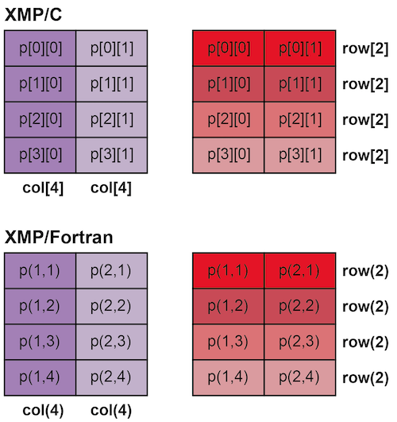

=================================
nodes directive
=================================

The nodes directive declares the name of a node set and its shape.
A node set can have a multi-dimensional shape.

.. contents::
   :local:
   :depth: 2

1-dimensional node set
----------------------

* XMP/C program

.. code-block:: C
   
   #pragma xmp nodes p[4]

* XMP/Fortran program

.. code-block:: Fortran

    !$xmp nodes p(4)

The nodes directive declares 1-dimensional node set p which has 4 nodes. 
In XMP/C, the node set consists of p[0], p[1], p[2], and p[3].
In XMP/Fortran, the node set consists of p(1), p(2), p(3), and p(4).

Multi-dimensional node set
--------------------------

* XMP/C program

.. code-block:: C

   #pragma xmp nodes p[2][3]

* XMP/Fortran program

.. code-block:: Fortran

    !$xmp nodes p(3,2)

The nodes directive declares 2-dimensional node set p which has 6 nodes.
In XMP/C, the node set consists of p[0][0], p[0][1], p[0][2], p[1][0], p[1][1], and p[1][2].
In XMP/Fortran, the node set consists of p(1,1), p(2,1), p(3,1), p(1,2), p(2,2), and p(3,2).

.. note::
   The ordering of the elements in a node set depends on the base language, C and Fortran.

Dynamic node set
------------------
* XMP/C program

.. code-block:: C

   #pragma xmp nodes p[*]

* XMP/Fortran program

.. code-block:: Fortran

    !$xmp nodes p(*)

An asterisk symbol can be used in the nodes directive to declare a dynamic node set.
The program declares 1-dimensional dynamic node set p by using an asterisk symbol.
The size of a dynamic node set is determined at runtime (at the beginning of the execution).
For example, when the user runs the sample program with 3 nodes, the node set p will have 3 nodes.

The user also can declare multi-dimensional dynamic nodes with an asterisk symbol.

* XMP/C program

.. code-block:: C

   #pragma xmp nodes p[*][3]

* XMP/Fortran program

.. code-block:: Fortran

    !$xmp nodes p(3,*)

When the user runs the sample program with 12 nodes, the node set p will have a shape of [4][3] in C, and (3,4) in Fortran.

.. note::
   The user can use only one asterisk symbol in the last dimension of the node set.

.. hint::
   The dynamic node set may interfere with compiler optimizations. Static node sets may achieve better performance in general.

Partial node set
------------------
The user can declare a partial node set from the existing node set.
Partial node sets can be used to optimize inter-node communication by reducing the number of nodes participating in the communication.

* XMP/C program

.. code-block:: C

   #pragma xmp nodes p[16]
   #pragma xmp nodes q[8]=p[0:8]
   #pragma xmp nodes r[4][2]=p[8:8]

* XMP/Fortran program

.. code-block:: Fortran

   !$xmp nodes p(16)
   !$xmp nodes q(8)=p(1:8)
   !$xmp nodes r(2,4)=p(9:16)

In line 1, a node set p which has 16 nodes is declared.
In line 2, a partial node set q from the first half of p is declared.
In line 3, a 2-dimensional partial node set r from the latter half of p is declared.

The user can declare an 1-dimensional node set from a multi-dimensional node set.

* XMP/C program

.. code-block:: C

   #pragma xmp nodes p[4][2]
   #pragma xmp nodes row[4]=p[:][*]
   #pragma xmp nodes col[2]=p[*][:]

* XMP/Fortran program

.. code-block:: Fortran

   !$xmp nodes p(2,4)
   !$xmp nodes row(4)=p(*,:)
   !$xmp nodes col(2)=p(:,*)

In line 1, a 2-dimensional node set p which has 4x2 nodes is declared.
In line 2, a partial node set row from a single row node set of p is declared.
In line 3, a partial node set col from a single column node set of p is declared.

The colon symbols used in the sample program are triplets which indicate that all elements in the dimension are used to declare the target partial node set.
The asterisk symbols indicate that the current executing node will be used to declare the target partial node set.
For example, col[2] is p[0][0:2] on node p[0][0]/p[0][1] and is p[1][0:2] on node p[1][0]/p[1][1] in XMP/C.
Likewise, col(2) is p(1:2,1) on node p(1,1)/p(2,1) and p(1:2,2) on node p(1,2)/p(2,2) in XMP/Fortran.

In XMP/C, both p[0][0] and p[0][1] will be row[0].
Likewise, p[0][0], p[1][0], p[2][0] and p[3][0] will be col[0] in each execution context.
In XMP/Fortran, both p(1,1) and p(2,1) will be row(1).
Likewise, p(1,1), p(1,2), p(1,3) and p(1,4) will be col(1) in each context.

.. note::
   The syntactic meaning of asterisk symbols in the node set references are different when declaring a node set  and regular expressions in on clauses.
