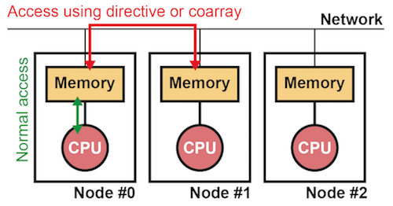
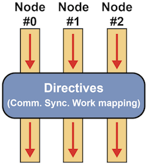

=========================
Introduction
=========================

.. contents::
   :local:
   :depth: 2

Background
----------------
Distributed-memory systems are generally used for large-scale simulations.
To program such systems, Message Passing Interface (MPI) is widely
adopted. However, the programming with MPI is difficult because
programmers must describe inter-process communications with
consideration of the execution flow of the programs, which might cause
deadlocks or wrong results.

To address this issue, a parallel language named High Performance
Fortran (HPF) was proposed in 1991. With HPF, users can execute their
serial programs in parallel by inserting minimal directives into
them. If users specify data distribution with HPF directives, compilers do
all other tasks for parallelization (e.g. communication generation and
work distribution).
However, HPF was not widely accepted eventually because the
compiler's automatic processing prevents users from performance tuning 
and the performance depends heavily on the environment (e.g. compiler
version and hardware)

.. note:: 
   For more detail, please refer:
   Ken Kennedy, Charles Koelbel and Hans Zima: The Rise and Fall of High Performance Fortran: An Historical Object Lesson, Proc. 3rd ACM SIGPLAN History of Programming Languages Conf. (HOPL-III), pp. 7-1-7-22 (2007).

In such circumstance, to development a new parallel programming model
that enables easy parallelization of existing serial programs and design
a new language based on it, "the XMP Specification Working Group" was
established in 2008.
This group utilized the lessons from the experience of HPF to define a
parallel language XcalableMP (XMP). The group was reorganized to
one of the working groups of `PC Cluster Consortium
<https://www.pccluster.org/ja>`_ in 2011.

Features
-------------
It is learned from the lessons of HPF that more automatic processing
of compilers increases the gap between a program and its execution,
and, as a result, decreases the usability of the language.

In XMP, users specify the details of parallel programs to make their
execution easy-to-understand. In particular, users can specify
explicitly communication, synchronization, data distribution, and work
distribution to facilitate performance tuning. In addition, XMP
supports features for one-sided communication on each process, which
was not available in HPF. This feature might enable users to implement
parallel algorithms easily.

Extension for C and Fortran
^^^^^^^^^^^^^^^^^^^^^^
XMP supports both C and Fortran as base languages while HPF is an extension
of only Fortran. It is advantages of XMP that it is easy to migrate with
low cost of learning because it is based on existing languages.

In this site, XMP for C and XMP for Fortran are referred as XMP/C and
XMP/Fortran, respectively. XMP for C++ is also under development.

Memory model
^^^^^^^^^^^^^^^^^^^^^^^^^^^^^^^^^^^^^^
XMP is a parallel programming language for distributed-memory systems.
A distributed-memory system is a system where distributed memory and
CPUs are connected with each other via network, as shown in the figure
below. However, actual hardware can be equipped with shared memory. In
such a case, each core on a chip can be regarded as a CPU in the
figure.

In XMP, a combination of memory and a single CPU is referred as a *node*,
which is an execution unit of XMP programs.
Accesses to remote data residing on another node is specified with
special constructs such as dedicated directives and *coarrays* while
accesses to local data residing within the node is specified in the
same way as in normal languages.

Execution model
^^^^^^^^^^^^^
The execution model of XMP follows the Single Program Multiple Data
(SPMD) model, like MPI.
According to this model, each node executes the same code
independently. When a node encounters a XMP construct, it cooperate
with each other to execute the construct.

Programming model
^^^^^^^^^^^^^^^^^^^^^^^^
XMP supports the following two programming models.

* Global-view
* Local-view

In the global-view model, users specify the collective behavior of nodes
in the target program to parallelize it.
As users specify with the directives how data and computation are
distributed on nodes, compilers are responsible for doing it.
This model is suitable for regular applications, such as
domain-decomposition problems, where every node works in a similar way.

In the local-view modes, users specify the behavior of each node, just
like MPI. Therefore, users are responsible for distributing data and
computation onto nodes. Communications in this model can be specified
in a one-sided manner based on coarrays. This model is suitable for
applications where each node performs a different task.

Users can use both of the two models in an XMP application.

Interoperability
^^^^^^^^^^^^^^^^^^^^^^^^^^^^^^^^^^^^
Most of existing parallel applications are written with MPI. It is not
realistic to port them over to XMP because each of them consists of millions of lines.

Because XMP is interoperable with MPI, users can develop an XMP
application by modifying a part of an existing one instead of rewriting it totally.
Besides, when developing a parallel application from scratch,
it is possible to use XMP to write a complicated part of, for example,
domain decomposition while they use MPI, which could be faster than XMP,
to write a hot-spot part that need to be tuned carefully. In addition,
XMP is interoperable with OpenMP and Python.

It might be difficult to develop an application with
just one programming language or framework since it generally has its
own strong and weak points. Thus, an XMP program is interoperable with
those in other languages to provide both high productivity and
performance.
