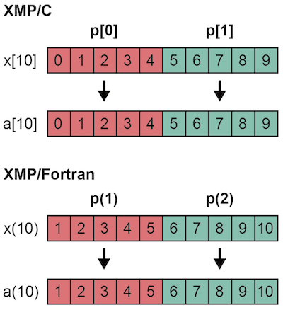
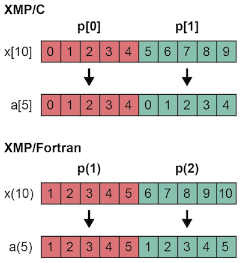

=================================
Procedure interface
=================================

Procedure calls in XMP are the same as the base language.
Procedure calls between different languages and external library are also possible if the base language supports them.

In the below example, sub1() calls sub2() with a distributed array as an argument.

* XMP/C program

.. code-block:: C

    void sub1(){
    #pragma xmp nodes p[2]
    #pragma xmp template t[10]
    #pragma xmp distribute t[block] onto p
      double x[10];
    #pragma xmp align x[i] with t[i]
      sub2(x);
    }

    void sub2(double a[10]){
    #pragma xmp nodes p[2]
    #pragma xmp template t[10]
    #pragma xmp distribute t[block] onto p
      double a[10];
    #pragma xmp align a[i] with t[i]
      :
    }

* XMP/Fortran program

.. code-block:: Fortran

    subroutine sub1()
    !$xmp nodes p(2)
    !$xmp template t(10)
    !$xmp distribute t(block) onto p
      real x(10)
    !$xmp align x(i) with t(i)
      call sub2(x)
    end subroutine
    
    subroutine sub2(a)
    !$xmp nodes p(2)
    !$xmp template t(10)
    !$xmp distribute t(block) onto p
      real a(10)
    !$xmp align a(i) with t(i)
      :
    end	subroutine

If you want to use distributed arrays in arguments as distributed arrays in the called procedure, you need to redefine the shape of the distributed array in the procedure.

But, if you want to use the distributed array in the argument as a duplicate array in the called procedure, you do not need to redefine them.

* XMP/C program

.. code-block:: C

    void sub1(){
    #pragma xmp nodes p[2]
    #pragma xmp template t[10]
    #pragma xmp distribute t[block] onto p
      double x[10];
    #pragma xmp align x[i] with t[i]
      sub2(x);
    }

    void sub2(double a[5]){
      :
    }

* XMP/Fortran program

.. code-block:: Fortran

    subroutine sub1()
    !$xmp nodes p(2)
    !$xmp template t(10)
    !$xmp distribute t(block) onto p
      real x(10)
    !$xmp align x(i) with t(i)
      call sub2(x)
    end subroutine

    subroutine sub2(a)
      real a(5)
      :
    end subroutine

