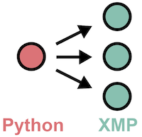

=================================
Cooperation with Python
=================================

We will show you how to call XMP program from Python program.
Currently, it supports only XMP/C.

.. note::
   The method of calling a Python program from the XMP program is the same as calling a Python program from each base language.

We provide two ways to call XMP program as follows.

.. contents::
   :local:
   :depth: 2

Calling from parallel Python program
------------------------------------
Calling the XMP program from a Python program which is running in parallel by the mpi4py package.
The number of parallel in the XMP program is the same as the number of parallel in the origin Python program.

.. image:: ../img/python/parallel.png

* Python program

.. code-block:: python

   import xmp
   from mpi4py import MPI
   
   lib = xmp.Lib("xmp.so")
   args = ([1,2,3], [4,5,6])
   job = lib.call(MPI.COMM_WORLD, "call_xmp", args)

* XMP/C program

.. code-block::	C
   
   void call_xmp(long a1[3], long a2[3]){
   #pragma xmp nodes p[3]
      :
   }

In the first line of the Python program, import XMP of Python package.
On line 4, specify the shared library created by the XMP program with the function you want to call.
In line 6, call the XMP program in that shared library.
The first argument of xmp.call() is the MPI communicator, which is used to generate the node set in the XMP program.
The second argument is the function name of the XMP program.
The third argument is an argument to be passed to the function of the XMP program.
If the argument of the XMP program function is unnecessary, the third argument of xmp.call() can be omitted.

Calling from the sequential Python program
------------------------------------
Call the parallel XMP program from the sequential Python program.

* Python program

.. code-block:: python

   import xmp
   
   lib = xmp.Lib("xmp.so")
   args = ([1,2,3], [3,4,5])
   job = lib.spawn(3, "call_xmp", args)

* XMP/C program

.. code-block:: C

   void call_xmp(long a1[3], long a2[3]){
   #pragma xmp nodes p[3]
      :
   }

The first argument of xmp.spawn() is the number of parallel of the XMP program and the second argument is the function name.
The third argument is an argument to be passed to the function of the XMP program.
If the argument of the XMP program function is unnecessary, the third argument of xmp.spawn() can be omitted.

xmp.spawn() waits until the specified XMP program is completed, but if you do not want to wait for completion of XMP, specify async as shown below.

.. code-block:: python

   job = lib.spawn(3, "call_xmp", args, async=True)
   // other work
   job.wait()

xmp.wait() guarantees completion of XMP program.

