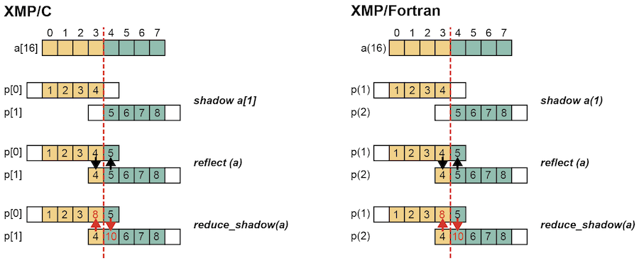
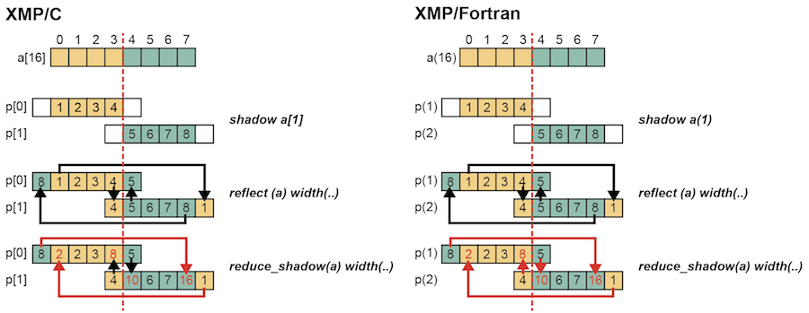

=================================
reduce_shadow directive
=================================
The reduce_shadow directive adds the value of the sleeve to the value of the source element.

* XMP/C program

.. code-block:: C

    #pragma xmp nodes p[2]
    #pragma xmp template t[8]
    #pragma xmp distribute t[block] onto p
    int a[8];
    #pragma xmp align a[i] with t[i]
    #pragma xmp shadow a[1]
     :
    #pragma xmp loop on t[i]
      for(int i=0;i<8;i++)
        a[i] = i+1;

     #pragma xmp reflect (a)
     #pragma xmp reduce_shadow (a)

* XMP/Fortran program

.. code-block:: Fortran

    !$xmp nodes p(2)
    !$xmp template t(8)
    !$xmp distribute t(block) onto p
      integer a(8)
    !$xmp align a(i) with t(i)
    !$xmp shadow a(1)

    !$xmp loop on t(i)
      do i=1, 8
        a(i) = i
      enddo

    !$xmp reflect (a)
    !$xmp reduce_shadow (a)

The shadow directive adds one sleeve to the distributed array a of each node.
Next, the reflect directive will update sleeves between neighboring nodes.
Finally, the reduce_shadow directive adds the value of the sleeve to the value of the source element.

In XMP/C, a[3] of p[0] has a value of 8, and a[4] of p[1] has a value of 10.
Similarly, in XMP/Fortran, a(4) of p(1) has a value of 8, and a(5) of p(2) has a value of 10.

You can add the periodic modifier to the width clause to execute periodic region updates.

* XMP/C program

.. code-block:: C

     #pragma xmp reflect (a) width(/periodic/1)
     #pragma xmp reduce_shadow (a) width(/periodic/1)

* XMP/Fortran program

.. code-block:: Fortran

  !$xmp reflect (a) width(/periodic/1)
  !$xmp reduce_shadow (a) width(/periodic/1)

In addition to the first example, in XMP/C, a[0] of p[0] has a value of 2, and a[7] of p[1] has a value of 16.
Similarly, in XMP/Fortran, a(1) in p(1) has a value of 2, and a(8) in p(2) has a value of 16.
