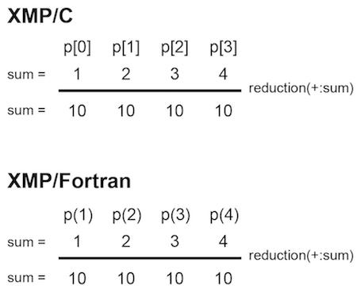

=================================
reduction construct
=================================

Execute reduction operation.
It has the same meaning as the reduction clause of :doc:`loop`, but the reduction directive can be described anywhere.

* XMP/C program

.. code-block:: C

   #pragma xmp nodes p[4]
     :
   sum = xmpc_node_num() + 1;
   #pragma xmp reduction (+:sum)

* XMP/Fortran program

.. code-block:: Fortran

    !$xmp nodes p(4)
      :
    sum = xmp_node_num()
    !$xmp reduction (+:sum)

You can set the range of the node set by using the on clause.
In the below example,
only the values of the last two nodes in four nodes are target to reduction operation.

* XMP/C program

.. code-block:: C

   #pragma xmp nodes p[4]
     :
   sum = xmpc_node_num() + 1;
   #pragma xmp reduction (+:sum) on p[2:2]

* XMP/Fortran program

.. code-block:: Fortran

   !$xmp nodes p(4)
     :
    sum = xmp_node_num()
    !$xmp reduction (+:sum) on p(3:4)

.. image:: ../img/reduction/reduction_on.png

The specifiable operators are as follows.

* XMP/C program

.. code-block:: bash

    +
    *
    -
    &
    |
    ^
    &&
    ||
    max
    min

* XMP/Fortran program

.. code-block:: bash

    +
    *
    -
    .and.
    .or.
    .eqv.
    .neqv.
    max
    min
    iand
    ior
    ieor

.. note::
   Since the reduction clause needs a loop statement, operators of firstmax, firstmin, lastmax, and lastmin are required.
   But, since the reduction directive does not need a loop statement, there are no such operators.

.. note::
   Similar to the reduction clause, the reduction directive may have slightly different results from sequential execution and parallel execution, because of depending on the calculation order when the reduction variable is a floating-point type.

