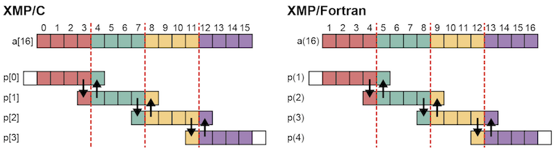
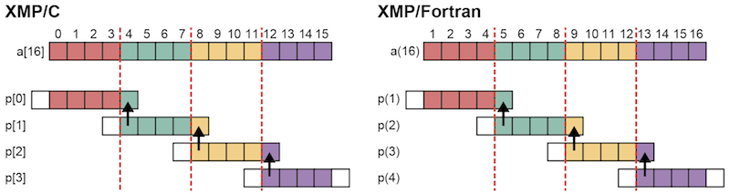
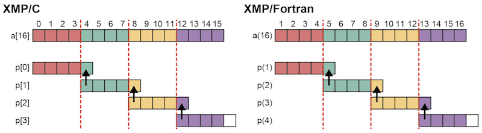
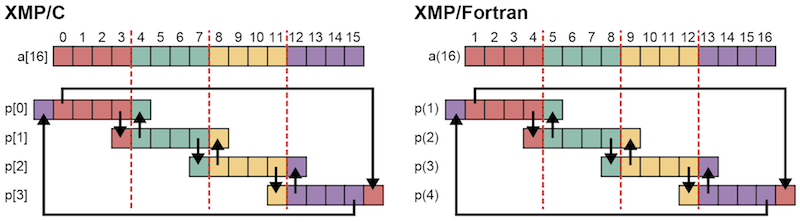
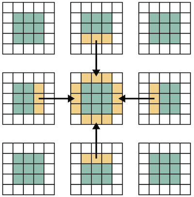
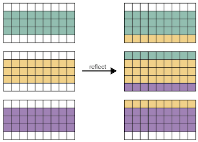

====================================
shadow directive / reflect construct
====================================

The stencil computation frequently appears in scientific computations,
where array elements a[i-1] and a[i+1] are referenced to update a[i].
If a[i] is on the boundary area of a distributed array on a node, a[i+1]
may reside on another node.

Because it costs largely to copy a[i+1] from the neighboring node to
update each a[i], a technique of copying collectively elements on the
neighboring node to the area added to the distributed array on each
node is usually adopted. In XMP, such additional region is referred as
"shadow."

Declare shadow
--------------

Shadow areas of the same size on the lower and upper bound.
^^^^^^^^^^^^^^^^^^^^^^^^^^^^^^^^^^^^^^^^^^^^^^^^^^^^^^^^^^^

Shadow areas can be declared with the shadow directive.
In the example below, an array a has shadow areas of size one on both the lower and upper bounds.

* XMP/C program

.. code-block:: C

   #pragma xmp nodes p[4]
   #pragma xmp template t[16]
   #pragma xmp distribute t[block] onto p
   double a[16];
   #pragma xmp align a[i] with t[i]
   #pragma xmp shadow a[1]

* XMP/Fortran program

.. code-block:: Fortran

   !$xmp nodes p(4)
   !$xmp template t(16)
   !$xmp distribute t(block) onto p
   real :: a(16)
   !$xmp align a(i) with t(i)
   !$xmp shadow a(1)

.. image:: ../img/shadow_reflect/shadow.png

In the figure above, colored elements are those that each node owns
and white ones are shadow.

.. note::
   Distributed arrays in a cyclic manner cannot have shadow.

When the widths on the Upper and Lower Bounds Are Different
^^^^^^^^^^^^^^^^^^^^^^^^^^^^^^^^^^^^^^^^^^^^^^^^^^^^^^^^^^^

For some programs, it is natural that the widths of the shadow area on
the lower and upper bounds are different.
There is also a case where the shadow area exists only on either of
the bounds. In the example below, it is declared that a distributed
array a has a shadow area of width one only on the upper bound.

* XMP/C program

.. code-block:: C

   #pragma xmp nodes p[4]
   #pragma xmp template t[16]
   #pragma xmp distribute t(block) onto p
   double a[16];
   #pragma xmp align a[i] with t[i]
   #pragma xmp shadow a[0:1]

* XMP/Fortran program

.. code-block:: Fortran

   !$xmp nodes p(4)
   !$xmp template t(16)
   !$xmp distribute t(block) onto p
   real :: a(16)
   !$xmp align a(i) with t(i)
   !$xmp shadow a(0:1)

.. image:: ../img/shadow_reflect/shadow_uneven.png

The values on the left and right sides of colon designate the widths on
the lower and upper bounds, respectively.

Update shadow
-------------

General Case
^^^^^^^^^^^^

To copy data to shadow areas from neighboring nodes, use the
reflect directive. In the example below, an array a having
shadow areas of width one on each the upper and lower bounds is reflected.

* XMP/C program

.. code-block:: C

   #pragma xmp reflect (a)

   #pragma xmp loop on t[i]
   for(int i=1;i<15;i++)
     a[i] = (a[i-1] + a[i] + a[i+1])/3;
   
* XMP/Fortran program

.. code-block:: Fortran

   !$xmp reflect (a)
   
   !xmp loop on t(i)
   do i=2, 15
     a(i) = (a(i-1) + a(i) + a(i+1))/3
   enddo

With this reflect directive, in XMP/C, node
p[1] sends an element a[4] to the shadow area on the upper
bound on node p[0] and a[7] to the shadow
area on the lower bound on p[2]; 
p[0] sends an element a[3] to the shadow area on the lower
bound on p[1], and p[2] sends a[8] to the shadow area on the upper bound on p[1].

Similarly, in XMP/Fortran, node
p(2) sends an element a(5) to the shadow area on the upper
bound on node p(1) and a(8) to the shadow
area on the lower bound on p(3);
p(1) sends an element a(4) to the shadow area on the lower
bound on p(2), and p(3) sends a(9) to the shadow
area on the upper bound on p(2).

Specifying the Update Width
^^^^^^^^^^^^^^^^^^^^^^^^^^^
The default behavior of a reflect directive is to update whole of
the shadow area declared by a shadow directive. However, there are
some cases where a specific part of the shadow area is to be updated
to reduce the communication size in a point of the code.

To update only a specific part of the shadow area, add the width
clause to the reflect directive.

The values on the left and right side of colon in the width clause
designate the widths on the lower and upper bounds to be updated,
respectively. In the example below, only the shadow area on the upper
bound is updated.

* XMP/C program

.. code-block:: C

   #pragma xmp reflect (a) width(0:1)

* XMP/Fortran program

.. code-block:: Fortran

   !$xmp reflect (a) width(0:1)

.. note::

   If the widths of the shadow areas to be updated on the upper and
   lower bounds are equal, that is, for example, width(1:1), you
   can abbreviate it as width(1).

.. note::

   It is not possible to update the shadow area on a particular node.

If no shadow area is specified on the lower bound, the reflect
directive does not update it with or without a width clause.
The below figure illustrates the behavior of a reflect directive
for a distributed array a having a shadow area of width one only
on the upper bound.

Update Periodic Shadow
^^^^^^^^^^^^^^^^^^^^^^

The reflect directive does not update either the shadow area on
the lower bound on the leading node or that on the upper bound on the
last node. However, the values in such areas are needed for stencil
computation if the computation needs a periodic boundary condition.

To update such areas, add a periodic qualifier into a width
clause. Let's look at the following example where an array a
having shadow areas of width one on both the lower and upper bounds
appears.

* XMP/C program

.. code-block:: C

   #pragma xmp reflect (a) width(/periodic/1:1)

* XMP/Fortran program

.. code-block:: Fortran

   !$xmp reflect (a) width(/periodic/1:1)

The periodic qualifier has the following effects, in addition to
that of a normal reflect directive: in XMP/C, node
p[0] sends an element a[0] to the shadow area on the upper
bound on node p[3], and p[3] sends a[15] to the shadow
area on the lower bound on p[0];
in XMP/Fortran, node
p(1) sends an element a(1) to the shadow area on the upper
bound on node p(4), and p(4) sends a(16) to the shadow
area on the lower bound on p(1).

.. note::

   If the widths of the shadow areas to be updated on the upper and
   lower bounds are equal, as shown by width(/periodic/1:1) in the
   above example, you can abbreviate it as width(/periodic/1).

Multidimensional Shadow
-----------------------

The shadow directive and reflect construct can be applied to arrays that is
distributed in multiple dimensions.
The following programs are the examples for two-dimensional distribution.

* XMP/C program

.. code-block:: C

   #pragma xmp nodes p[3][3]
   #pragma xmp template t[9][9]
   #pragma xmp distribute t[block][block] onto p
   double a[9][9];
   #pragma xmp align a[i][j] with t[i][j]
   #pragma xmp shadow a[1][1]
      :
   #pragma xmp reflect (a)

* XMP/Fortran program

.. code-block:: Fortran

   !$xmp nodes p(3,3)
   !$xmp template t(9,9)
   !$xmp distribute t(block,block) onto p
   real :: a(9,9)
   !$xmp align a(j,i) with t(j,i)
   !$xmp shadow a(1,1)
      :
   !$xmp reflect (a)

.. image:: ../img/shadow_reflect/multi.png

The central node receives the shadow data from the surrounding eight nodes.
The shadow areas of the other nodes are also updated, which is omitted
in the figure.

For some applications, data from ordinal directions are not necessary.
In such a case, the data communication from/to the ordinal directions
can be avoided by adding a orthogonal clause to a reflect construct.

* XMP/C program

.. code-block:: C

   #pragma xmp reflect (a) orthogonal

* XMP/Fortran program

.. code-block:: Fortran

   !$xmp reflect (a) orthogonal

.. note::

   The orthogonal clause is effective only for arrays more than one
   dimension of which is distributed.

Besides, you can also add shadow areas to only specidifed dimension.

* XMP/C program

.. code-block:: C

  #pragma xmp nodes p[3]
  #pragma xmp template t[9]
  #pragma xmp distribute t[block] onto p
  double a[9][9];
  #pragma xmp align a[i][*] with t[i]
  #pragma xmp shadow a[1][0]
    :
  #pragma xmp reflect (a)

* XMP/Fortran program

.. code-block:: Fortran

  !$xmp nodes p[3]
  !$xmp template t[9]
  !$xmp distribute t[block] onto p
  real :: a(9,9)
  !$xmp align a(*,i) with t(i)
  !$xmp shadow a(0,1)
    :
  !$xmp reflect (a)

In the array specified in the shadow directive,
0 is set as the shadow width in dimensions which are not distributed.

