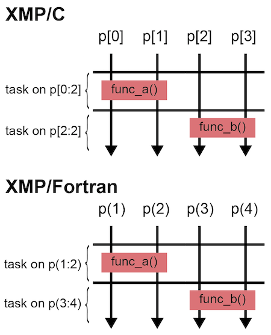
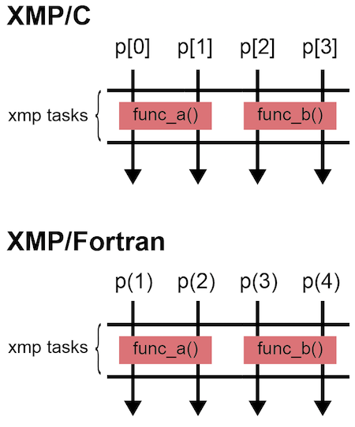

=================================
task/tasks construct
=================================

A task construct generates a task, which is executed by the specified
nodes.
A tasks construct asserts that surrounding task constructs can be executed in parallel.

This page shows some examples of the task construct other than those in :doc:`tutorial-global`.

.. contents::
   :local:
   :depth: 2

task construct
-------------------------------------

The on clause of the task construct specifies the node set that
executes the task.

* XMP/C program

.. code-block:: C

    #include <stdio.h>
    #pragma xmp nodes p[4]

    int main(){
      int num = xmpc_node_num();
    #pragma xmp task on p[1:3]
    {
      printf("%d: Hello\n", num);
    }

      return 0;
    }

* XMP/Fortran program

.. code-block:: Fortran

    program main
    !$xmp nodes p(4)
      integer :: num

      num = xmp_node_num()
    !$xmp task on p(2:4)
      write(*,*) num, ": Hello"
    !$xmp end task

    end program main

In the above example, nodes p[1], p[2], and p[3] execute the printf()
function and p[1] outputs "1: Hello" in XMP/C, and
p(2), p(3), and p(4) execute the write statement, and p(2) outputs "2:
Hello" in XMP/Fortran.

Note that a new node set is generated by each task construct.
Consider inserting a bcast construct into a task.

* XMP/C program

.. code-block:: C

    #pragma xmp task on p[1:3]
    {
    #pragma xmp bcast (num)
    }

* XMP/Fortran program

.. code-block:: Fortran

    !$xmp task on p(2:4)
    !$xmp bcast (num)
    !$xmp end task

This bcast construct is executed by the node set specified by the task construct.
Thus, the node p[1] broadcasts the value to p[2] and p[3] in XMP/C, and p(2)
to p(3) and p(4) in XMP/Fortran.

.. image:: ../img/task_tasks/task.png

The bcast construct in the above code is equivalent to that in the
following code, where it is executed by a new node set that is explicitly declared.

* XMP/C program

.. code-block:: C

    #pragma xmp nodes q[3] = p[1:3]
    #pragma xmp bcast (num) on q

* XMP/Fortran program

.. code-block:: Fortran

    !$xmp nodes q(3) = p(2:4)
    !$xmp bcast (num) on q

Note that the task is executed by the node set specified by the on clause.
Therefore, xmpc_node_num() and xmp_node_num() return the id the node set.

For example, consider inserting xmpc_node_num() or xmp_node_num() into
the task in the first program.

* XMP/C program

.. code-block:: C

    #include <stdio.h>
    #pragma xmp nodes p[4]

    int main(){
    #pragma xmp task on p[1:3]
    {
      printf("%d: Hello\n", xmpc_node_num());
    }

      return 0;
    }

* XMP/Fortran program

.. code-block:: Fortran

    program main
    !$xmp nodes p(4)

    !$xmp task on p(2:4)
      write(*,*) xmp_node_num(), ": Hello"
    !$xmp end task

    end program main

The node p[1] outputs "0: Hello" in XMP/C and p(2) "1: Hello" in XMP/Fortran.

.. note::
   A new node set should be collectively generated by all of the
   executing nodes at the point of task construct unless it is surrounded
   by a tasks construct. In the above example, p[0] in XMP/C and p(1)
   in XMP/Fortran must execute the task construct.

tasks construct
----------------
Consider that each of two tasks invokes a function.

* XMP/C program

.. code-block:: C

    #pragma xmp nodes p[4]

    #pragma xmp task on p[0:2]
    {
      func_a();
    }
    #pragma xmp task on p[2:2]
    {
      func_b();
    }

* XMP/Fortran program

.. code-block:: Fortran

    !$xmp nodes p(4)
    
    !$xmp task on p(1:2)
      call func_a()
    !$xmp end task
    !$xmp task on p(3:4)
      call func_b()
    !$xmp end task

In the above example, the two tasks cannot be executed in parallel
because those on clauses must be evaluated by all of the executing nodes.

Use the tasks construct to execute multiple task in parallel.

* XMP/C program

.. code-block:: C

    #pragma xmp nodes p[4]

    #pragma xmp tasks
    {
    #pragma xmp task on p[0:2]
    {
      func_a();
    }
    #pragma xmp task on p[2:2]
    {
      func_b();
    }
    }

* XMP/Fortran program

.. code-block:: Fortran

    !$xmp nodes p(4)

    !$xmp tasks
    !$xmp task on p(1:2)
      call func_a()
    !$xmp end task
    !$xmp task on p(3:4)
      call func_b()
    !$xmp end task
    !$xmp end tasks

The node sets specified by the on clauses of task constructs surrounded by a task
construct can be executed in parallel.

