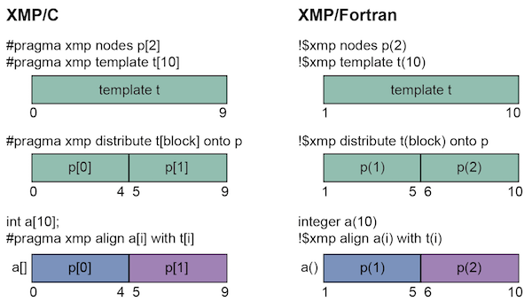
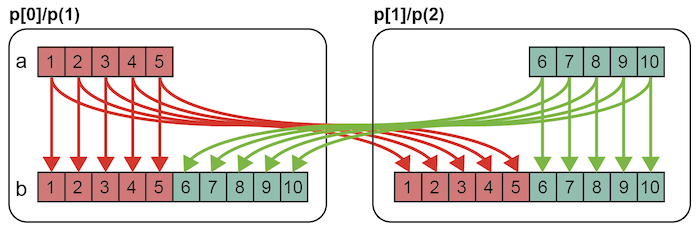

===================================
Tutorial (Global-view)
===================================

.. contents::
   :local:
   :depth: 2

Introduction
-----------
In the global-view model of XcalableMP (XMP), the user adds directives into the serial code to specify parallelism. 
The following actions can be described by XMP directives.

* Data Mapping (divides data and distributes it among nodes)
* Work Mapping (divides workload and distributes it among nodes)
* Inter-node Communication (exchange data between nodes)

This tutorial introduces the basics of XMP.
A simple sequential code will be parallelized by adding XMP directives.

* C Program

.. code-block:: C

    #include <stdio.h>

    int main(){
      int a[10];

      for(int i=0;i<10;i++){
        a[i] = i+1;
        printf("%d\n", a[i]);
      }

      return 0;
    }

* Fortran Program

.. code-block:: Fortran

    program main
      integer a(10)
    
      do i=1, 10
        a(i) = i
        write(*,*) a(i)
      enddo
    end program main

Compilers such as gcc/gfortran translate the sequential code into a binary, which generates the following output.

.. code-block:: bash

    1
    2
    3
    4
    5
    6
    7
    8
    9
    10

XMP provides several directives to parallelize the sequential code.

Data Mapping
-------------------------------------------------------
The user use the nodes, template, distribute, and align directive to specify data mappong among nodes.
Directives start with "#pragma xmp" in XMP/C, and "!$xmp" in XMP/Fortran.

* XMP/C Program (incomplete)

.. code-block:: C

    #include <stdio.h>
    
    int main(){
    #pragma xmp nodes p[2]
    #pragma xmp template t[10]
    #pragma xmp distribute t[block] onto p
      int a[10];
    #pragma xmp align a[i] with t[i]

      for(int i=0;i<10;i++){
        a[i] = i+1;
        printf("%d\n", a[i]);
      }

      return 0;
    }

* XMP/Fortran Program (incomplete)

.. code-block:: Fortran

    program main
    !$xmp nodes p(2)
    !$xmp template t(10)
    !$xmp distribute t(block) onto p
      integer a(10)
    !$xmp align a(i) with t(i)

      do i=1, 10
        a(i) = i
        write(*,*) a(i)
      enddo
    end program main

In the above example, the user specify data mapping of array a (10 elements) among 2 nodes (5 elements per node).

The nodes directive declares node p of size 2.
The template declares template t of size 10.
In XMP, array indices start from 0 in [], and start from 1 in ().
Node p has element p[0] and p[1] and template t has elements from t[0] to t[9] in the XMP/C style.
In XMP/Fortran, node p has element p(1) and p(2) and template t has elements from t(1) to t(10).

.. note::
    For some historical reasion, the user can use both [] and () in XMP/C.
	[] is not available in XMP/Fortran.
    However, we recommand to use the same syntax to the base language．

The distribute directive distributes template elements among nodes.
In XMP/C, elements from t[0] to t[4] are assigned to p[0] and the remaining elements are assigned to p[1].
In XMP/Fortran, elements from t(1) to t(5) are assigned to p(1) and the remaining elements are assigned to p(2).

The align directive assigns target array elements based on the specified template.
Each align directive has to be declared before the target array definition.

In XMP/C, elements from a[0] to a[4] are assgiend to p[0] and the remaining elements are assigned to p[1].
In XMP/Fortran, elements from a(1) to a(5) are assigned to p(1) and the remaining elements are assigned to p(2).

The following figure illustrates the behavior of XMP directives for data mapping.

The target array specified in the align directive is called "distributed array"
Other arrays are called "replicated array" when they are not specified in data mapping directives.

Work Mapping
------------------

loop Directive
^^^^^^^^^^^

The user uses the loop directive to specify work mapping of the following loop statement.

* XMP/C Program

.. code-block:: C

    #include <stdio.h>

    int main(){
    #pragma xmp nodes p[2]
    #pragma xmp template t[10]
    #pragma xmp distribute t[block] onto p
      int a[10];
    #pragma xmp align a[i] with t[i]

    #pragma xmp loop on t[i]
      for(int i=0;i<10;i++){
        a[i] = i+1;
        printf("%d\n", a[i]);
      }

      return 0;
    }

* XMP/Fortran Program

.. code-block:: Fortran

    program main
    !$xmp nodes p(2)
    !$xmp template t(10)
    !$xmp distribute t(block) onto p
      integer a(10)
    !$xmp align a(i) with t(i)

    !$xmp loop on t(i)
      do i=1, 10
        a(i) = i
        write(*,*) a(i)
      enddo
    end program main

In the above example, iterations from 0 to 4 are mapped onto p[0] and iterations 5 to 9 are mapped onto p[1] (in XMP/C).
In XMP/Fortran, iterations from 1 to 5 are mapped onto p(1) and iterations 6 to 10 are mapped onto p(2).

The following output shows the execution result of the sample program with 2 nodes.
Each node prints out the list of assigned array values.

.. code-block:: bash

   1
   2
   3
   4
   5
   6
   7
   8
   9
   10

In the parallel execution, the order of each node's output can be changed or merged.

.. code-block:: bash

   6
   7
   8
   9
   10
   1
   2
   3
   4
   5

task Directive
^^^^^^^^^^^
The task directive limits the range of execution nodes and changes the execution context.
The task speficies the parallel execution of the following compound statement.
In XMP/Fortran, the end task directive is required to specify the end of the region.

* XMP/C Program

.. code-block:: C

    #include <stdio.h>

    int main(){
    #pragma xmp nodes p[2]
    
    #pragma xmp task on p[0]
      {
        printf("Hello\n");
      }
      return 0;
    }

* XMP/Fortran Program

.. code-block:: Fortran

    program main
    !$xmp nodes p(2)

    !$xmp task on p(1)
      write(*,*) "Hello"
    !$xmp end task
    end program main

In the above example, p[0] prints out "Hello" on the screen (in XMP/C).
In XMP/Fortran, p(1) prints out the result．

The user can use a integer triplet to specify multiple nodes.

* XMP/C Program

.. code-block:: C

    [start:length:stride]

* XMP/Fortran Program

.. code-block:: Fortran

    (start:end:stride)

XMP/Fortran follows the syntax of the array section in Fortran.

XMP/C has a different form. Triplets in XMP/C is written as [start:size:step].

Start means the start index of the node group.
When start is omitted, the range start with the first element.
Size means the size of the specified node group.
When size is omitted, the node group has elements starting from start to the defined size (with specified step).
Step can be specified to declare a discontinuous node group.
When step is omitted, 1 will be used.

For example, p[0:5] specifies 5 nodes starting from p[0] (from p[0] to p[4]).
p[0:5:2] has p[0], p[2], p[4], p[6], p[8].

The following shows some examples of triplet. The size of node p is 20 (from p[0] to p[19]).

+-----------+------------------------------------------------+
| Triplet   | Meaning                                        |
+===========+================================================+
| p[5:10]   | 10 nodes starting from p[5]                    |
+-----------+------------------------------------------------+
| p[:10]    | 10 nodes starting from p[0]                    |
+-----------+------------------------------------------------+
| p[10:]    | node elemente from p[10] to p[19]              |
+-----------+------------------------------------------------+
| p[:]      | every node elements (from p[0] to p[19])       |
+-----------+------------------------------------------------+
| p[0:5:2]  | p[0], p[2], p[4], p[6], p[8]                   |
+-----------+------------------------------------------------+

.. note:: 
    In XMP/Fortran, triplet can be written as (start:end:step). End specifies the last elements in the node group.

The following program uses the task directive to specify the first two nodes in the original node group.

* XMP/C Program

.. code-block:: C

    #include <stdio.h>

    int main(){
    #pragma xmp nodes p[4]
    
    #pragma xmp task on p[0:2]
      {
        printf("Hello\n");
      }
      return 0;
    }

* XMP/Fortran Program

.. code-block:: Fortran

    program main
    !$xmp nodes p(4)

    !$xmp task on p(1:2)
      write(*,*) "Hello"
    !$xmp end task
    end program main

Inter-node Communication
-----------------
XMP provides some directives specifying typical inter-node communication patterns.

* XMP/C Program

.. code-block:: C

    #include <stdio.h>

    int main(){
    #pragma xmp nodes p[2]
    #pragma xmp template t[10]
    #pragma xmp distribute t[block] onto p
      int a[10], b[10];
    #pragma xmp align a[i] with t[i]

    #pragma xmp loop on t[i]
      for(int i=0;i<10;i++){
        a[i] = i+1;
      }

    #pragma xmp gmove
      b[:] = a[:];

    #pragma xmp task on p[0]
    {
      for(int i=0;i<10;i++)
        printf("%d\n", b[i]);
    }

      return 0;
    }
    
* XMP/Fortran Program

.. code-block:: Fortran

    program main
    !$xmp nodes p(2)
    !$xmp template t(10)
    !$xmp distribute t(block) onto p
      integer a(10), b(10)
    !$xmp align a(i) with t(i)

    !$xmp loop on t(i)
      do i=1, 10
        a(i) = i
      enddo

    !$xmp gmove
      b(:) = a(:)

    !$xmp task on p(1)
      do i=1, 10
        write(*,*) b(i)
      enddo
    !$xmp end task
    end program main

Array b is a replicated array which has the same shape to distributed array a.
The program uses the gmove directive to collect all elements from array a to local array b.
The task directive is used to print out the elements in array b by a single node.

The gmove directive specified a collective communication between distribute/replicated arrays.
The compiler generates collective communication required for the following assignment statement.
Triplet form can be used in the assignment statement to specify multiple elements.

In the program, all distributed data elements are collected from the owner nodes to the local array.
The following figure illustrates the inter-node communication generated by the compiler.

If the target element is allocated locally, data can be moved within the memory, while
inter-node communication is required if the target element is allocated in a remote node.

The following outout shows the result of the program.
p[0] (in XMP/C) or p(1) (in XMP/Fortran) prints out the result.
The output sequence is always the same because it is handled by a single node.

.. code-block:: bash

    1
    2
    3
    4
    5
    6
    7
    8
    9
    10

.. note::
    All communication in XMP should be specified explicitly since the language does not assume automatic inter-node communication (which is a big difference its ancestor, HPF).
    This design choice makes the performance model clear to user and easier to optimize the performance.