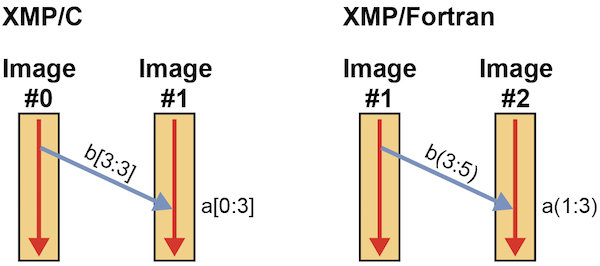
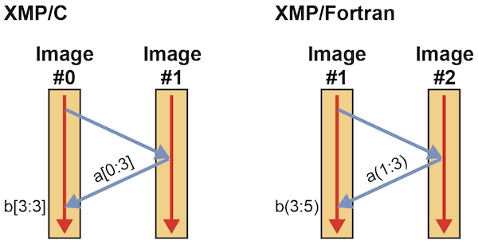
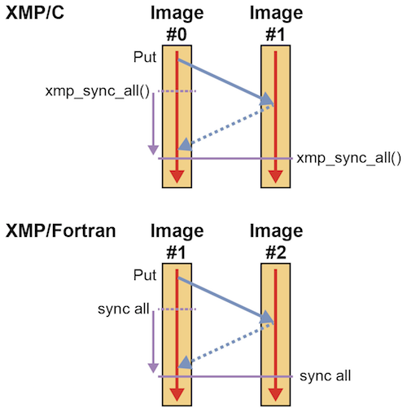

=================================
Tutorial (Local-view)
=================================

.. contents::
   :local:
   :depth: 2

Introduction
-----------
The user uses Coarray in the local-view model to desctibe one-sided communication.
In XMP, put/get communication and some synchronization functions are supported.

If the target system supports Remote Direct Memory Access（RDMA） in the hardware,
one-sided communication in the local-view model can achieve better performance compared to the global-view model.
However, it requires more effort to describe parallel program since all communication should be specified in detail.

XMP/Fortran supports Coarray in the standard Fortran 2008.
Coarray in XMP/C has its own original syntax since the C language does not support Coarray.

.. note:: XMP/Fortran has upward compatibility with Fortran 2008.

The basic unit of execution in the local-view is called "image" while it is called "node" in the global-view model.
The two words has the same meaning in XMP.

Coarray Declaration
---------------
* XMP/C program

.. code-block:: C

    int a[10]:[*];

* XMP/Fortran program

.. code-block:: Fortran

   integer a(10)[*]

In XMP/C, the user declares a Coarray by adding :[] (Coarray dimension) after the array declaration.
In XMP/Fortran, the user declares a Coarray by adding [] after the array declaration.
The asterisk symbol is used in the both language.

.. note::
    Based on Fortran 2008, the Coarray should have the same size of the entire execution node group.

Coarray can be accessed from other images using assignment statements.
Of course, coarray can be also accessed from your image like ordinary array.

One-sided Communication
---------
Put Communication
^^^^^^^^^

When the Coarray reference appears in the left hand side in a assignment statement, it causes put communication.

* XMP/C program

.. code-block:: C

    int a[10]:[*], b[10];
    
    if (xmpc_this_image() == 0)
      a[0:3]:[1] = b[3:3];

* XMP/Fortran program

.. code-block:: Fortran

   integer a(10)[*]
   integer b(10)

   if (this_image() == 1) then
     a(1:3)[2] = b(3:5)
   end if

The integer number in the Coarray dimension specifies the targer image.
Each image index starts with 0 in XMP/C and starts with 1 in XMP/Fortran.
xmpc_this_image() in XMP/C and this_image() XMP/Fortran return the current image index.

.. note::
   In XMP/Fortran, image index starts with 1 while it uses [] (similar to C style for array dimension) to specify Coarray dimension
   based on the standard Fortran 2008.

.. note::
   When Coarray dimension appears on both side, 3 nodes (target, source, current node) involve the communication.

In the above example, XMP/C puts b[3:3] on image 0 to a[0:3] on image 1.
XMP/Fortran puts b(3:5) on image 1 to a(1:3) on image 2.
The following figure illustrates the one-sided communication done by Corray.

.. note::
   The directives in the global-view model invoke point-to-point communication.
   On the other hand, Coarrays in the local-view model invoke one-sided communication.

Get Communication
^^^^^^^^^
When a Coarray appears in the right hand side in the assignment statement, it causes get communication.

* XMP/C program

.. code-block:: C

    int a[10]:[*], b[10];

    if (xmpc_this_image() == 0)
      b[3:3] = a[0:3]:[1];

* XMP/Fortran program

.. code-block:: Fortran

   integer a(10)[*]
   integer b(10)

   if (this_image() == 1) then
     b(3:5) = a(1:3)[2]
   end if

In the above program, XMP/C gets a[0:3] from image 1 and store them on b[3:3] of image 0.
XMP/Fortran gets a(1:3) from image 2 and store them on b(3:5) of image 1.
The following figure illustrates Coarray get communication.

.. hint::
   As illustrated get needs an extra step to send a request to the target node.
   Put communication achieves better performance than get since there is no such extra step.

Synchronization
---------
Here, we introduce "sync all" which is most frequently used among Coarray synchronization functions.

* XMP/C program

.. code-block:: C

    void xmp_sync_all(int *status)

* XMP/Fortran program

.. code-block:: Fortran

    sync all

The "sync all" waits all issued one-sided communication and invokes barrier synchronization among the entire images.

In the above example, the left image puts data to the right image and both nodes invoke sync all. 
When both nodes finish sync all, the the execution continues after the synchronization point.

Tutorial
----------
Run the following sample using 2 images.

* XMP/C program

.. code-block:: C

   #include <stdio.h>
   #include <xmp.h>
   int a[10]:[*], b[10]:[*], c[10][10]:[*];
   
   int main(){
     int me = xmpc_this_image();
   
     for(int i=0;i<10;i++)
       a[i] = b[i] = i + 10 * me;
   
     for(int i=0;i<10;i++)
       for(int j=0;j<10;j++)
         c[i][j] = (i * 10 + j) + 100 * me;
   
     xmp_sync_all(NULL);
    
     if(xmpc_this_image() == 0){
       a[0:3] = a[5:3]:[1];            // Get
       for(int i=0;i<10;i++)
         printf("%d\n", a[i]);
   
       b[0:5:2] = b[0:5:2]:[1];       // Get
       printf("\n");
       for(int i=0;i<10;i++)
         printf("%d\n", b[i]);
   
       c[0:5][0:5]:[1] = c[0:5][0:5]; // Put
     }
     xmp_sync_all(NULL);
   
     if(xmpc_this_image() == 1){
       printf("\n");
       for(int i=0;i<10;i++){
         for(int j=0;j<10;j++){
         printf("  %3d",c[i][j]);
         }
         printf("\n");
       }
     }
   
     return 0;
   }

* XMP/Fortran program

.. code-block:: Fortran

   program main
     implicit none
     include "xmp_coarray.h"
     integer :: a(10)[*], b(10)[*], c(10,10)[*]
     integer :: i, j, me
   
     me = this_image()
   
     do i=1, 10
       b(i) = (i-1) + 10 * (me - 1)
       a(i) = b(i)
     end do
   
     do i=1, 10
       do j=1, 10
         c(j,i) = ((i-1) * 10 + (j-1)) + 100 * (me - 1)
       end do
     end do
     
     sync all
   
     if (this_image() == 1) then
       a(1:3) = a(6:8)[2] ! Get
       do i=1, 10
         write(*,*) a(i)
       end do
     
       b(1:10:2) = b(1:10:2)[2];  ! Get
       write(*,*) ""
       do i=1, 10
         write(*,*) b(i)
       end do
   
       c(1:5,1:5)[2] = c(1:5,1:5) ! Put
     end if
   
     sync all
   
     if (this_image() == 2) then
       write(*,*) ""
       do i=1, 10
         write(*,*) c(:,i)
       end do
     end if
   end program main
 
In the above example, 3 Coarrays a, b, c are declared.
a and b are 1-dimensional arrays and c is a 2-dimensional array.
The following shows the initial values of each array.

* Image 0 in XMP/C, Image 1 in XMP/Fortran
   * a : from 0 to 9
   * b : from 0 to 9
   * c : from 0 to 99
* Image 1 in XMP/C, Image 2 in XMP/Fortran
   * a : from 10 to 19
   * b : from 10 to 19
   * c : from 100 to 199

One-sided Communication for a Contiguous Region
^^^^^^^^^^^^^^^^^^^^^
In the first get communication, in XMP/C, image 0 gets a[5:3] from image 1 and stores them to a[0:3].
In XMP/Fortran, image 1 gets a[6:8] from image 2 and stores them to a(1:3)

After the communication, array a has the following values.

.. code-block:: bash

  15
  16
  17
  3
  4
  5
  6
  7
  8
  9

One-sided Communication for a Discontiguous Region
^^^^^^^^^^^^^^^^^^^^^
In the second get communication, in XMP/C, image 0 gets b[0:5:2] from image 1 and stores them to b[0:5:2].
In XMP/Fortran, image 1 gets b(1:10:2) from image 2 and stores them to b(1:10:2).

After the communication, array b has the following values.

.. code-block:: bash
  
  10
  1
  12
  3
  14
  5
  16
  7
  18
  9

One-sided Communication for Multi-dimensional Arrays
^^^^^^^^^^^^^^^^^^^^^
In the put communication, in XMP/C, image 0 puts c[0:5][0:5] to on c[0:5][0:5] image 1.
In XMP/Fortran, image 1 puts c(1:5,1:5) to c(1:5,1:5) on image 2.
The communication has the block-strided communication pattern.

After the communication, array c has the following values.

.. code-block:: bash

    0    1    2    3    4  105  106  107  108  109
   10   11   12   13   14  115  116  117  118  119
   20   21   22   23   24  125  126  127  128  129
   30   31   32   33   34  135  136  137  138  139
   40   41   42   43   44  145  146  147  148  149
  150  151  152  153  154  155  156  157  158  159
  160  161  162  163  164  165  166  167  168  169
  170  171  172  173  174  175  176  177  178  179
  180  181  182  183  184  185  186  187  188  189
  190  191  192  193  194  195  196  197  198  199
