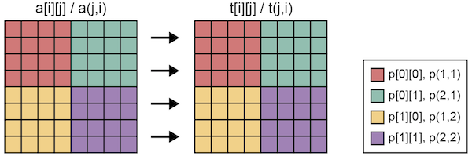

=================================
align指示文
=================================

align指示文は，分散されたテンプレートにしたがい，配列を各ノードに分散させることにより分散配列を作成します．
align指示文は，配列の宣言の後に挿入します．

.. contents::
   :local:
   :depth: 2

通常の整列
--------------

* XMP/Cプログラム

.. code-block:: C

    #pragma xmp nodes p[4]
    #pragma xmp template t[8]
    #pragma xmp	distribute t[block] onto p
    int a[8];
    #pragma xmp align a[i] with t[i]

* XMP/Fortranプログラム

.. code-block:: Fortran

    !$xmp nodes p(4)
    !$xmp template t(8)
    !$xmp distribute t(block) onto p
    integer :: a(8)
    !$xmp align a(i) with t(i)

align指示文は，配列aの要素iをテンプレートtの要素iに整列させます．

.. image:: ../img/align/1dim.png

同様に，多次元配列も整列できます．

* XMP/Cプログラム

.. code-block:: C

    #pragma xmp	nodes p[2][2]
    #pragma xmp	template t[8][8]
    #pragma xmp distribute t[block][block] onto p
    int a[8][8];
    #pragma xmp align a[i][j] with t[i][j]

* XMP/Fortranプログラム

.. code-block:: Fortran

    !$xmp nodes p(2,2)
    !$xmp template t(8,8)
    !$xmp distribute t(block,block) onto p
    integer :: a(8,8)
    !$xmp align a(j,i) with t(j,i)

特殊な整列
-------------
縮退
^^^^^^
2次元配列を1次元テンプレートに整列させる場合は，下記のように記述します．

* XMP/Cプログラム

.. code-block:: C

    #pragma xmp nodes p[4]
    #pragma xmp template t[8]
    #pragma xmp distribute t[block] onto p
    int a[8][8];
    #pragma xmp align a[i][*] with t[i]

* XMP/Fortranプログラム

.. code-block:: Fortran

    !$xmp nodes p(4)
    !$xmp template t(8)
    !$xmp distribute t(block) onto p
    integer :: a(8,8)
    !$xmp align a(*,i) with t(i)

align指示文の配列の要素にアスタリスクを用いると，その次元は整列しないことを意味します．
下記の例では，2次元配列の1次元目だけをブロック分散させています．

.. image:: ../img/align/collapse.png

XMP/Cでは，a[0:2][:]の実体はp[0]に存在します．
同様に，XMP/Fortranでは，a(:,1:2)の実体はp(1)に存在します．

複製
^^^^^^
前節とは逆に，1次元配列を2次元テンプレートに整列させる場合は，下記のように記述します．

* XMP/Cプログラム

.. code-block:: C

    #pragma xmp nodes p[2][2]
    #pragma xmp template t[8][8]
    #pragma xmp distribute t[block][block] onto p
    int a[8];
    #pragma xmp align a[i] with t[i][*]

* XMP/Fortranプログラム

.. code-block:: Fortran

    !$xmp nodes p(2,2)
    !$xmp template t(8,8)
    !$xmp distribute t(block,block) onto p
    integer :: a(8)
    !$xmp align a(i) with t(*,i)

align指示文のテンプレートの要素にアスタリスクを用いると，その次元と対応しているすべてのノードが配列の複製を持つという意味になります．

.. image:: ../img/align/replicate.png

XMP/Cでは，a[0:4]の実体はp[0][0]とp[0][1]の2ノードが持ちます．
同様に，XMP/Fortranでは，a(1:4)の実体はp(1,1)とp(2,1)の2ノードが持ちます．
