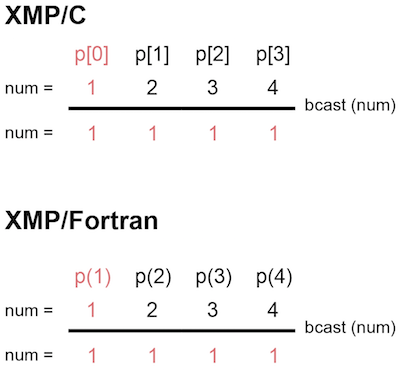
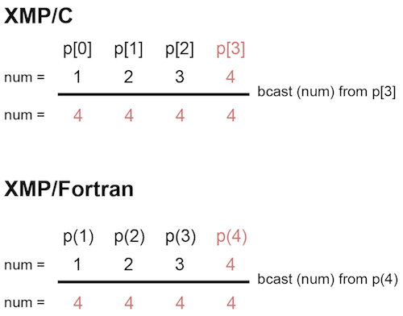
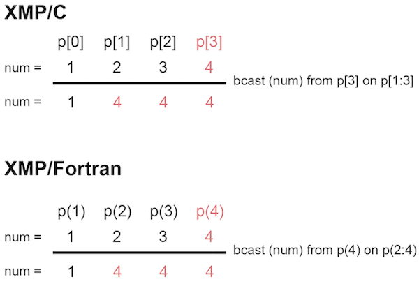

=================================
bcast指示文
=================================

from節で指定されたノードが持つ変数を，on節で指定されたノード集合に対して放送通信を行います．
from節を省略した場合は，対象ノード集合の最初のノードが起点となります．
on節を省略した場合は，現在実行しているノード集合が対象となります．

下記の例では，ノード集合pの最初のノードが起点となります．

* XMP/Cプログラム

.. code-block:: C

   #pragma xmp nodes p[4]
     :
   num = xmpc_node_num() + 1;
   #pragma xmp bcast (num)

* XMP/Fortranプログラム

.. code-block:: Fortran

    !$xmp nodes p(4)
      :
    num = xmp_node_num()
    !$xmp bcast (num)

下記の例では，from節によってノード集合pの最後のノードを起点としています．

* XMP/Cプログラム

.. code-block:: C

   #pragma xmp nodes p[4]
     :
   num = xmpc_node_num() + 1;
   #pragma xmp bcast (num) from p[3]

* XMP/Fortranプログラム

.. code-block:: Fortran

    !$xmp nodes p(4)
      :
    num = xmp_node_num()
    !$xmp bcast (num) from p(4)

下記の例では，on節によって4ノード中の後半の3ノードの値のみを通信の対象としています．	

* XMP/Cプログラム

.. code-block:: C

   #pragma xmp nodes p[4]
     :
   sum = xmpc_node_num() + 1;
   #pragma xmp bcast (num) from p[3] on p[1:3]

* XMP/Fortranプログラム

.. code-block:: Fortran

   !$xmp nodes p(4)
     :
    sum = xmp_node_num()
    !$xmp bcast (num) from p(4) on p(2:4)

