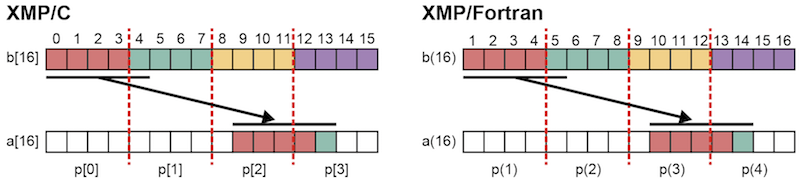
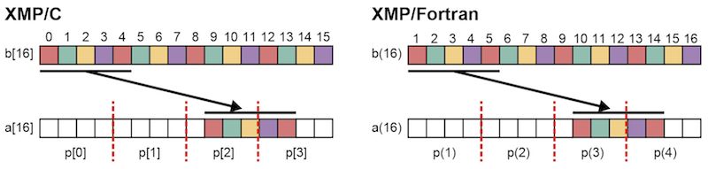
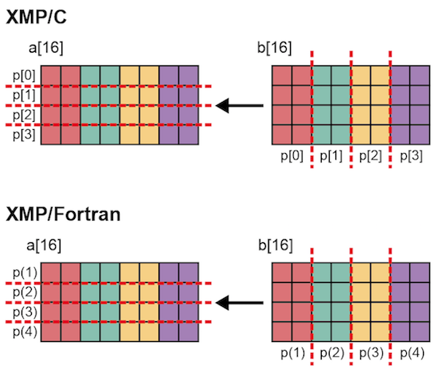
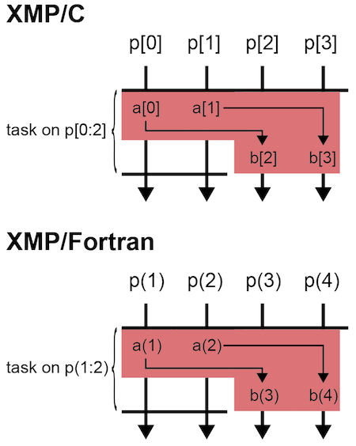

=================================
gmove指示文
=================================

gmove指示文を用いると，分散配列に対する通信を代入文の形式で記述できます．

gmoveには集合モード，inモード，outモードの3つのモードがあります．
集合モードは実行しているノード内で（両側）通信を行いますが，
inモードとoutモードでは，task指示文と併用してタスク間で片側通信を行います．
inモードはGet通信であり，outモードはPut通信です．

.. contents::
   :local:
   :depth: 2

集合モード
------------------

分散配列間の通信
^^^^^^^^^^^^^^^^^^^
配列aの一部を配列bにコピーします．gmove内の配列代入文では，tripletを用います．

* XMP/Cプログラム

.. code-block:: C

    #pragma xmp nodes p[4]
    #pragma xmp template t[16]
    #pragma xmp distribute t[block] onto p
    int a[16], b[16];
    #pragma xmp align a[i] with t[i]
    #pragma xmp align b[i] with t[i]
         :
    #pragma xmp gmove
      a[9:5] = b[0:5];

* XMP/Fortranプログラム

.. code-block:: Fortran

    !$xmp nodes p(4)
    !$xmp template t(16)
    !$xmp distribute t(block) onto p
    integer :: a(16), b(16)
    !$xmp align a(i) with t(i)
    !$xmp align b(i) with t(i)
         :
    !$xmp gmove
      a(10:14) = b(1:5)

gmove指示文は，XMP/Cでは，p[0]はb[0]からb[3]をp[2]とp[3]に送信し，p[1]はb[4]をp[3]に送信します．
同様に，XMP/Fortranでは，p(1)はb(1)からb(4)をp(3)とp(4)に送信し，p(2)はb(5)をp(4)に送信します．

上の例では，同じ形状で分散した配列同士の代入文でしたが，もちろん異なる形状で分散した配列同士についても代入を行うことができます．

* XMP/Cプログラム

.. code-block:: C

    #pragma xmp nodes p[4]
    #pragma xmp template t1[16]
    #pragma xmp template t2[16]
    #pragma xmp distribute t1[cyclic] onto p
    #pragma xmp distribute t2[block] onto p
    int a[16], b[16];
    #pragma xmp align a[i] with t1[i]
    #pragma xmp align b[i] with t2[i]
         :
    #pragma xmp gmove
      a[9:5] = b[0:5];

* XMP/Fortranプログラム

.. code-block:: Fortran

    !$xmp nodes p(4)
    !$xmp template t1(16)
    !$xmp template t2(16)
    !$xmp distribute t1(cyclic) onto p
    !$xmp distribute t2(block) onto p
    integer :: a(16), b(16)
    !$xmp align a(i) with t1(i)
    !$xmp align b(i) with t2(i)
         :
    !$xmp gmove
      a(10:14) = b(1:5)

配列aはcyclic分散，配列bはblock分散されています．

gmove指示文は，XMP/Cでは，p[0]はb[0]とb[4]をp[2]とp[3]に送信します．p[1]はb[1]をp[2]に送信します．p[2]とp[3]の各要素についてはローカルコピーが行われます．
同様に，XMP/Fortranでは，p(1)はb(1)とb(5)をp(3)とp(4)に送信します．p(2)はb(2)をp(3)に送信します．p(3)とp(4)の各要素についてはローカルコピーが行われます．

.. note::
   
   右辺で指定された要素数が1以外の場合で，右辺と左辺とで要素数が異なると正常に動作しません．

この方法を用いると，計算途中で分散配列の形状を変えることができます．

.. code-block:: C

    #pragma xmp nodes p[4]
    #pragma xmp template t1[16]
    #pragma xmp template t2[16]
    int W[4] = {2,4,8,2};
    #pragma xmp distribute t1[gblock(W)] onto p
    #pragma xmp distribute t2[block] onto p
    int a[16], b[16];
    #pragma xmp align a[i] with t1[i]
    #pragma xmp align b[i] with t2[i]
         :
    #pragma xmp gmove
      a[:] = b[:];

* XMP/Fortranプログラム

.. code-block:: Fortran

    !$xmp nodes p(4)
    !$xmp template t1(16)
    !$xmp template t2(16)
    integer :: W(4) = (/2,4,7,3/)
    !$xmp distribute t1(gblock(W)) onto p
    !$xmp distribute t2(block) onto p
    integer :: a(16), b(16)
    !$xmp align a(i) with t1(i)
    !$xmp align b(i) with t2(i)
         :
    !$xmp gmove
      a(:) = b(:)

.. image:: ../img/gmove/gmove_change.png

上の例では，block分散されている配列bの全要素を，gblock分散されている配列aにコピーしています．
配列aと配列bにおいて，担当ノードが一致していない要素についてのみ通信が発生します（図中の矢印はノード間通信を意味します）．

スカラーの通信
^^^^^^^^^^^^^^^
代入文において，右辺に1要素，左辺に複数要素が指定された場合，放送通信の動作になります．

* XMP/Cプログラム

.. code-block:: C

    #pragma xmp nodes p[4]
    #pragma xmp template t[16]
    #pragma xmp distribute t[block] onto p
    int a[16], b[16];
    #pragma xmp align a[i] with t[i]
    #pragma xmp align b[i] with t[i]
         :
    #pragma xmp gmove
      a[9:5] = b[0];

* XMP/Fortranプログラム

.. code-block:: Fortran

    !$xmp nodes p(4)
    !$xmp template t(16)
    !$xmp distribute t(block) onto p
    integer :: a(16), b(16)
    !$xmp align a(i) with t(i)
    !$xmp align b(i) with t(i)
         :
    !$xmp gmove
      a(10:14) = b(1)

.. image:: ../img/gmove/gmove_one_element.png

上の例では，XMP/Cでは，ノードp[0]が持つ要素b[0]が，ノードp[2]とp[3]の指定された位置に放送されます．
同様に，XMP/Fortranでは，ノードp(1)が持つ要素b(1)が，ノードp(3)とp(4)の指定された位置に放送されます．

重複配列やスカラ変数の通信
^^^^^^^^^^^^^^^^^^^^^^^^^^^^^^
右辺は分散配列のみでなく，重複配列や普通のスカラ変数でも可能です．

* XMP/Cプログラム（一部）

.. code-block:: C

    #pragma xmp nodes p[4]
    #pragma xmp template t[16]
    #pragma xmp distribute t[block] onto p
    int a[16], b[16], c;
    #pragma xmp align a[i] with t[i]
         :
   #pragma xmp gmove
      a[9:5] = b[0:5];

   #pragma xmp gmove
      a[9:5] = c;

* XMP/Fortranプログラム

.. code-block:: Fortran

    !$xmp nodes p(4)
    !$xmp template t(16)
    !$xmp distribute t(block) onto p
    integer :: a(16), b(16), c
    !$xmp align a(i) with t(i)
         :
   !$xmp gmove
      a(10:14) = b(1:5)

   !$xmp gmove
      a(10:14) = c

上の例では，重複配列とスカラ変数が分散配列にローカルコピーされます．
そのため，通信は発生しません．

分割次元の異なる分散配列間の通信
^^^^^^^^^^^^^^^^^^^^^^^^^^^^^^^^^^

* XMP/Cプログラム

.. code-block:: C

    #pragma xmp nodes p[4]
    #pragma xmp template t1[8]
    #pragma xmp template t2[16]
    #pragma xmp distribute t1[block] onto p
    #pragma xmp distribute t2[block] onto p
    int a[8][16], b[8][16];
    #pragma xmp align a[i][*] with t1[i]
    #pragma xmp align b[*][i] with t2[i]
         :
    #pragma xmp gmove
      a[0][:] = b[0][:];

* XMP/Fortranプログラム

.. code-block:: Fortran

    !$xmp nodes p(4)
    !$xmp template t1(8)
    !$xmp template t2(16)
    !$xmp distribute t1(block) onto p
    !$xmp distribute t2(block) onto p
    integer :: a(16,8), b(8,16)
    !$xmp align a(*,i) with t1(i)
    !$xmp align b(i,*) with t2(i)
         :
    #pragma xmp gmove
      a(:,1) = b(:,1)

上の例では，XMP/Cでは，p[0]が持っているb[0][0:2]，p[1]が持っているb[0][2:2]，p[2]が持っているb[0][4:2]，p[3]が持っているb[0][6:2]が，p[0]のa[0][:]にコピーされます．
同様に，XMP/Fortranでは，p(1)が持っているb(1:2,1)，p(2)が持っているb(3:4,1)，p(3)が持っているb(5:6,1)，p(4)が持っているb(7:8,1)が，p(1)のa(:,1)にコピーされます．

inモード
---------
gmove指示文にin節をつけることで，inモードとして動作します．

* XMP/Cプログラム

.. code-block:: C

   #pragma xmp nodes p[4]
   #pragma xmp template t[4]
   #pragma xmp distribute t[block] onto p
   double a[4], b[4];
   #pragma xmp align a[i] with t[i]
   #pragma xmp align b[i] with t[i]
      :
   #pragma xmp task on p[0:2]
   #pragma xmp gmove in
     a[0:2] = b[2:2]
   #pragma xmp end task

* XMP/Fortranプログラム

.. code-block:: Fortran

   !$xmp nodes p(4)
   !$xmp template t(4)
   !$xmp distribute t(block) onto p
   real :: a(4), b(4)
   !$xmp align a(i) with t(i)
   !$xmp align b(i) with t(i)
      :
   !$xmp task on p(1:2)
   !$xmp gmove in
     a(1:2) = b(3:4)
   !$xmp end task

上の例では，まずtask指示文は，4ノードのノード集合を前半と後半の2ノードずつに分けています．
inモードのgmove指示文では，後半のノードが持っている配列を，前半のノードが持っている配列に対するGet通信を実行しています．

.. image:: ../img/gmove/gmove_in.png

outモード
-----------
gmove指示文にin節をつけることで，outモードとして動作します．

* XMP/Cプログラム

.. code-block:: C

   #pragma xmp nodes p[4]
   #pragma xmp template t[4]
   #pragma xmp distribute t[block] onto p
   double a[4], b[4];
   #pragma xmp align a[i] with t[i]
   #pragma xmp align b[i] with t[i]
      :
   #pragma xmp task on p[0:2]
   #pragma xmp gmove out
     b[2:2] = a[0:2]
   #pragma xmp end task

* XMP/Fortranプログラム

.. code-block:: Fortran

   !$xmp nodes p(4)
   !$xmp template t(4)
   !$xmp distribute t(block) onto p
   real :: a(4), b(4)
   !$xmp align a(i) with t(i)
   !$xmp align b(i) with t(i)
      :
   !$xmp task on p(1:2)
   !$xmp gmove out
     b(3:4) = a(1:2)
   !$xmp end task

上の例は，inモードの代入文を逆にしただけです．
outモードのgmove指示文では，前半のノードが持っている配列を後半のノードが持っている配列に対するPut通信を実行しています．

