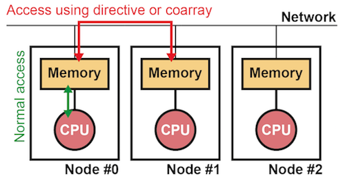
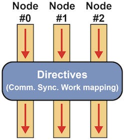

=========================
はじめに
=========================

.. contents::
   :local:
   :depth: 2

XMP誕生の背景
----------------
大規模シミュレーションなどを行うには，分散メモリシステムの利用が一般的です．
そのプログラミングにはMessage Passing Interface（MPI）が広く用いられていますが，MPIは実行フローをユーザが意識した上で，プロセス間の通信を記述する必要があります．
そのため，些細なプログラムのミスによるデットロックや結果不正になる危険が常にあり，そのプログラミングは容易ではありません．

そこで，Fortranに最小限の指示文を挿入するだけで，
逐次プログラムを並列プログラムとして実行できる並列言語High Performance Fortran（HPF）が1991年に提案されました．
ユーザはHPFが提供する指示文を使って，データが各プロセスにどのように分散されているかを指示するのみで，それ以外の並列化の作業（通信や処理の分割など）はすべてコンパイラが行ってくれます．
しかし，HPFはコンパイラが多くの作業を自動で行う仕様であるため，ユーザによる性能チューニングが難しく，
またコンパイラのバージョンやハードウェアが変わると性能も大きく変わる可能性があるため，結果として普及しませんでした．

.. note:: 
   より詳しいことは，次の文献が詳しいです．
   Ken Kennedy, Charles Koelbel and Hans Zima: The Rise and Fall of High Performance Fortran: An Historical Object Lesson, Proc. 3rd ACM SIGPLAN History of Programming Languages Conf. (HOPL-III), pp. 7-1-7-22 (2007).

このような背景から，逐次プログラムからの簡易な並列化を支援する並列実行モデルの確立と，それに基づく新たなプログラミング言語の設計を行うため，2008年に「次世代並列プログラミング言語検討委員会」が設立されました．
この委員会において，HPFの経験から得た教訓を元に設計された並列言語XcalableMP（XMP）が誕生しました．
次世代並列プログラミング言語検討委員会は，2011年から `PCクラスタコンソーシアム <https://www.pccluster.org/ja>`_ の「並列プログラミング言語XMP規格部会」として活動しています．

XMPの特徴
-------------
HPFの経験から，コンパイラの自動化の適用範囲が広がるほどプログラムと実際の動作の乖離が大きくなり，逆にユーザは利用しづらくなることがわかりました．

そこで，XMPではプログラムからその動作が容易に想像できるレベルまでユーザが記述するスタイルをとっています．
具体的には，通信・同期・データ分割・処理分割などをユーザが明示的に記述することで，性能チューニングを簡易に行えるようにしています．
また，HPFにはなかった，個別のプロセスを意識したプログラミングを行える片側通信記法を追加しています．
この記法を用いることで，並列アルゴリズムを簡易に実装できます．

C言語とFortranの拡張
^^^^^^^^^^^^^^^^^^^^^^
HPFはFortranのみの拡張ですが，XMPではC言語とFortranの両方を拡張しています．
XMPは既存の言語をベースとしているので，並列プログラムへの移行が容易であり，さらに学習コストも小さい，といった特徴があります．

本サイトでは，XMP版のC言語を「XMP/C」，XMP版のFortranを「XMP/Fortran」と呼びます．
なお，C++言語についても対応を検討中です．

メモリモデル
^^^^^^^^^^^^^^^^^^^^^^^^^^^^^^^^^^^^^^
XMPは分散メモリシステムを対象とする並列プログラミング言語です．
分散メモリシステムとは，下図のように，分散されたメモリとCPUがネットワークで接続されたシステムのことです．
ただし，実際のハードウェアは共有メモリでも構いません．
その場合は，チップ内の各コアを図中のCPUと考えることができます．

XMPでは，メモリとCPUの組を「ノード」と呼び，ノードを実行単位とします．
XMPはデータを各ノードに分散させ，そのデータに対応する計算を並列に実行します．
ノード内におけるメモリアクセスは通常のプログラミングと同じである一方，
ノード間におけるメモリアクセスは通信を行う構文（指示文や片側通信記法）で行います．

実行モデル
^^^^^^^^^^^^^
XMPの実行モデルはMPIと同じSPMD（Single Program, Multiple Data streams）です．
各ノードが独立に重複して実行が開始します．
そして，指示文の箇所では，各ノードが協調して動作します．

プログラミングモデル
^^^^^^^^^^^^^^^^^^^^^^^^
XMPは，下記の2通りのプログラミングモデルをサポートしています．

* Global-view（グローバルビュー）
* Local-view（ローカルビュー）

グローバルビューでは，データや計算をグローバルなイメージで記述することで，
逐次プログラムのように並列プログラムを作成することができます．
各ノードに対するデータや計算の実際の割り当ては，ユーザが挿入する指示文を元にコンパイラが行います．
グローバルビューは領域分割問題のような全ノードが同じ動作をするアプリケーションの作成に向いています．

ローカルビューでは，MPIと同様にデータや計算をノード毎に記述します．
すなわち，各ノードに対するデータや計算の割り当てはユーザが手動で行う必要があります．
ローカルビューにおける通信は，Coarray Fortran（CAF）をベースにした片側通信記法で行います．
ローカルビューは各ノードの振る舞いが異なるアプリケーションの作成に向いています．

XMPでは，グローバルビューとローカルビューは共存できるように設計されているので，
1つのアプリケーション内でグローバルビューとローカルビューの両方を使うことも可能です．

他言語との連携
^^^^^^^^^^^^^^^^^^^^^^^^^^^^^^^^^^^^
現在の並列アプリケーションの多くはMPIが用いられています．
1つの並列アプリケーションであっても数百万行に及ぶものも存在するため，
そのコードのすべてをXMPで書き換えることは非現実的です．

そこで，XMPはMPIと共存できるような仕様になっています．
この仕様により，アプリケーション全体をXMPで書き直す必要はなく，部分的な変更のみを既存のアプリケーションに対して行うだけで，XMPアプリケーションを作成できます．
また，例えば最初から並列アプリケーションを作成する場合であっても，煩雑な領域分割の箇所はXMPでシンプルに記述し，
特に細かな性能チューニングが必要な箇所だけ高速なMPIライブラリを用いる，ということが可能です．
同様に，OpenMPやPythonとの連携も可能です．

一般に，1つのプログラミング言語には得意・不得意なことがあるため，
1つの汎用的なプログラミング言語やフレームワークでアプリケーションを作成することは困難なことがあります．
そこで，XMPでは，それぞれの言語が得意とする機能を適材適所に使い分けることにより，高生産性と高性能の両立を目指しています．

