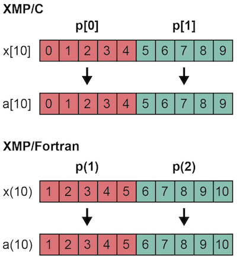

=================================
プロシージャ・インタフェース
=================================

XMPにおけるプロシージャの呼び出しは，基本的にはベース言語と同じです．
異なる言語間のプロシージャや外部ライブラリの呼び出しも，ベース言語が対応していれば可能です．

下の例では，sub1()は分散配列を引数にしてsub2()を呼び出しています．

* XMP/Cプログラム

.. code-block:: C

    void sub1(){
    #pragma xmp nodes p[2]
    #pragma xmp template t[10]
    #pragma xmp distribute t[block] onto p
      double x[10];
    #pragma xmp align x[i] with t[i]
      sub2(x);
    }

    void sub2(double a[10]){
    #pragma xmp nodes p[2]
    #pragma xmp template t[10]
    #pragma xmp distribute t[block] onto p
      double a[10];
    #pragma xmp align a[i] with t[i]
      :
    }

* XMP/Fortranプログラム

.. code-block:: Fortran

    subroutine sub1()
    !$xmp nodes p(2)
    !$xmp template t(10)
    !$xmp distribute t(block) onto p
      real x(10)
    !$xmp align x(i) with t(i)
      call sub2(x)
    end subroutine
    
    subroutine sub2(a)
    !$xmp nodes p(2)
    !$xmp template t(10)
    !$xmp distribute t(block) onto p
      real a(10)
    !$xmp align a(i) with t(i)
      :
    end	subroutine

呼び出されるプロシージャ内で，引数にある分散配列を分散配列として用いたい場合は，その分散配列の形状をプロシージャ内で再定義する必要があります．

ただし，呼び出されるプロシージャ内で，引数にある分散配列を重複配列として用いたい場合は，再定義を行う必要はありません．

* XMP/Cプログラム

.. code-block:: C

    void sub1(){
    #pragma xmp nodes p[2]
    #pragma xmp template t[10]
    #pragma xmp distribute t[block] onto p
      double x[10];
    #pragma xmp align x[i] with t[i]
      sub2(x);
    }

    void sub2(double a[5]){
      :
    }

* XMP/Fortranプログラム

.. code-block:: Fortran

    subroutine sub1()
    !$xmp nodes p(2)
    !$xmp template t(10)
    !$xmp distribute t(block) onto p
      real x(10)
    !$xmp align x(i) with t(i)
      call sub2(x)
    end subroutine

    subroutine sub2(a)
      real a(5)
      :
    end subroutine

.. image:: ../img/procedure/duplicated_array.png

