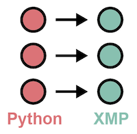
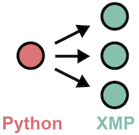

=================================
Pythonとの連携
=================================

PythonプログラムからXMPプログラムを呼び出す方法について紹介します．

.. note::
   逆のパターンであるXMPプログラムからPythonプログラムを呼び出す方法については，
   各ベース言語からPythonプログラムを呼び出す手順と同じです．

下記の2通りのXMPプログラムの呼び出し方を提供しています．

.. contents::
   :local:
   :depth: 2

並列Pythonプログラムからの呼び出し
------------------------------------
mpi4pyパッケージによって並列に動作しているPythonプログラムからXMPプログラムを呼び出します．
XMPプログラムの並列数は，起点のPythonプログラムの並列数と同じになります．

* Pythonプログラム

.. code-block:: python

   import xmp
   from mpi4py import MPI
   
   lib = xmp.Lib("xmp.so")
   args = ([1,2,3], [4,5,6])
   job = lib.call(MPI.COMM_WORLD, "call_xmp", args)

* XMP/Cプログラム

.. code-block::	C
   
   void call_xmp(long a1[3], long a2[3]){
   #pragma xmp nodes p[3]
      :
   }

Pythonプログラムの1行目で，PythonパッケージのXMPをインポートします．
4行目で，呼び出したい関数のあるXMPプログラムで作られた共有ライブラリを指定します．
6行目で，その共有ライブラリ内にあるXMPプログラムを呼び出します．
xmp.call()の第1引数はMPIコミュニケータであり，XMPプログラムのノード集合の生成に用いられます．
第2引数はXMPプログラムの関数名です．
第3引数はXMPプログラムの関数に渡す引数です．
XMPプログラムの関数に引数が不要な場合，xmp.call()の第3引数は省略できます．

逐次Pythonプログラムからの呼び出し
------------------------------------
逐次のPythonプログラムから並列XMPプログラムを呼び出します．

* Pythonプログラム

.. code-block:: python

   import xmp
   
   lib = xmp.Lib("xmp.so")
   args = ([1,2,3], [3,4,5])
   job = lib.spawn(3, "call_xmp", args)

* XMP/Cプログラム

.. code-block:: C

   void call_xmp(long a1[3], long a2[3]){
   #pragma xmp nodes p[3]
      :
   }

xmp.spawn()の第1引数はXMPプログラムの並列数であり，第2引数は関数名です．
第3引数はXMPプログラムの関数に渡す引数です．
XMPプログラムの関数に引数が不要な場合，xmp.spawn()の第3引数は省略できます．

xmp.spawn()は指定したXMPプログラムの完了まで待機しますが，
XMPの完了を待たない場合は，下記のようにasyncの指定を行います．

.. code-block:: python

   job = lib.spawn(3, "call_xmp", args, async=True)
   // other work
   job.wait()

xmp.wait()で，XMPプログラムの完了を保証します．

