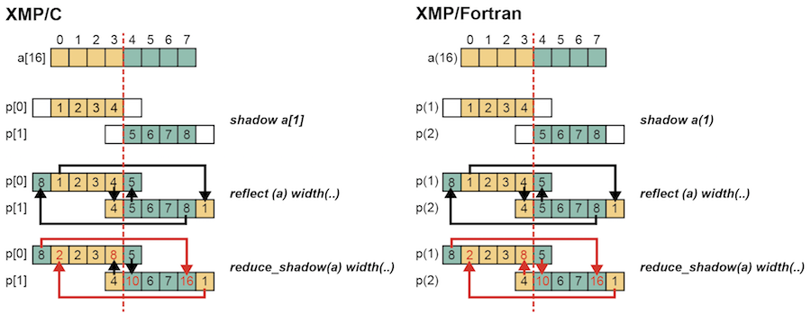

=================================
reduce_shadow指示文
=================================
reduce_shadow指示文は，袖の値を同期元の要素の値に加算します．

* XMP/Cプログラム

.. code-block:: C

    #pragma xmp nodes p[2]
    #pragma xmp template t[8]
    #pragma xmp distribute t[block] onto p
    int a[8];
    #pragma xmp align a[i] with t[i]
    #pragma xmp shadow a[1]
     :
    #pragma xmp loop on t[i]
      for(int i=0;i<8;i++)
        a[i] = i+1;

     #pragma xmp reflect (a)
     #pragma xmp reduce_shadow (a)

* XMP/Fortranプログラム

.. code-block:: Fortran

    !$xmp nodes p(2)
    !$xmp template t(8)
    !$xmp distribute t(block) onto p
      integer a(8)
    !$xmp align a(i) with t(i)
    !$xmp shadow a(1)

    !$xmp loop on t(i)
      do i=1, 8
        a(i) = i
      enddo

    !$xmp reflect (a)
    !$xmp reduce_shadow (a)

shadow指示文は，各ノードが持つ分散配列aに対して袖を1要素追加します．
次に，reflect指示文は，隣接ノード間で袖の更新を行います．
最後に，reduce_shadow指示文は，袖の値を同期元の要素の値に加算します．

XMP/Cでは，p[0]のa[3]は8の値を持ち，p[1]のa[4]は10の値を持ちます．
同様に，XMP/Fortranでは，p(1)のa(4)は8の値を持ち，p(2)のa(5)は10の値を持ちます．

.. image:: ../img/reduce_shadow/reduce_shadow.png

周期的な領域の更新を行うために，periodic修飾子をwidth節に追加することもできます．

* XMP/Cプログラム

.. code-block:: C

     #pragma xmp reflect (a) width(/periodic/1)
     #pragma xmp reduce_shadow (a) width(/periodic/1)

* XMP/Fortranプログラム

.. code-block:: Fortran

  !$xmp reflect (a) width(/periodic/1)
  !$xmp reduce_shadow (a) width(/periodic/1)

最初の例に追加して，XMP/Cでは，p[0]のa[0]は2の値を持ち，p[1]のa[7]は16の値を持ちます．
同様に，XMP/Fortranでは，p(1)のa(1)は2の値を持ち，p(2)のa(8)は16の値を持ちます．
