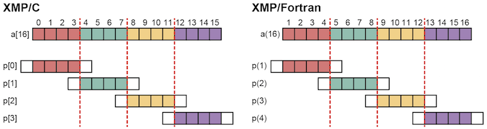
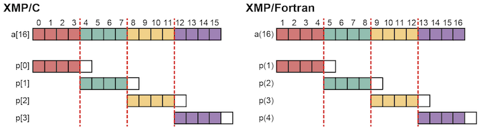
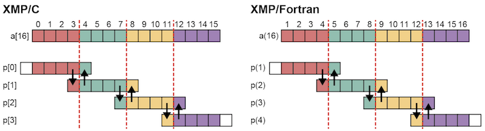
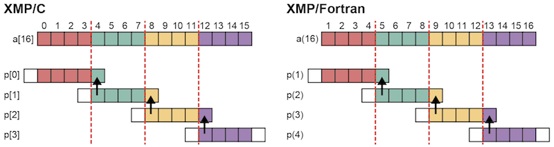
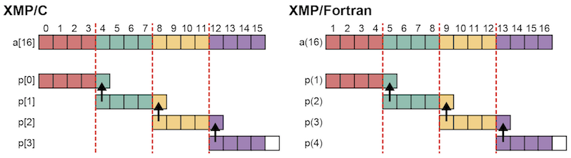
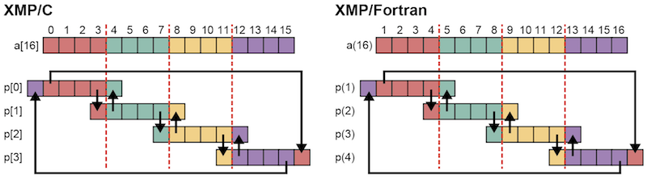
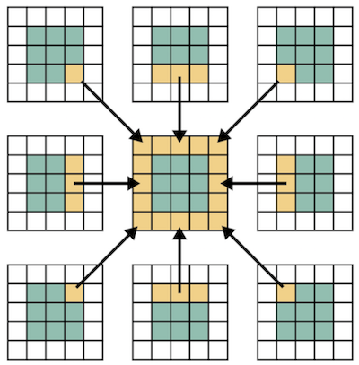
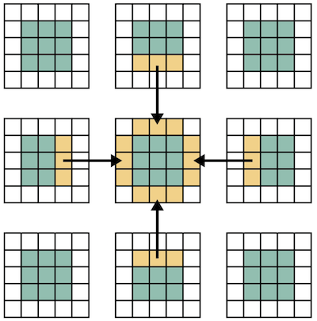
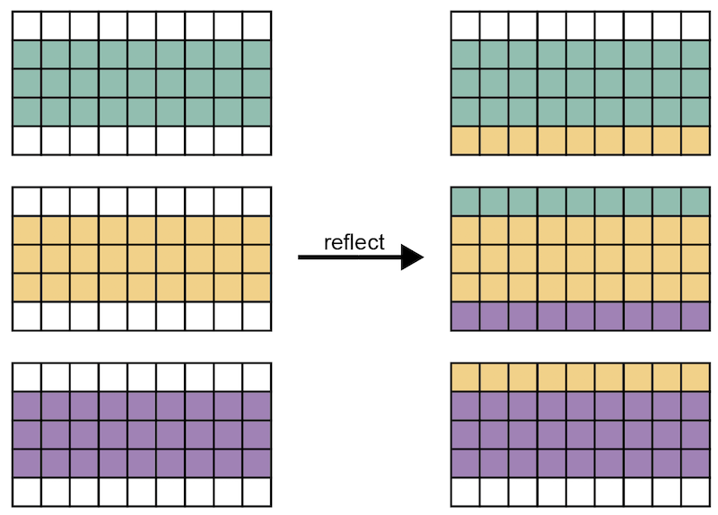

============================
shadow/reflect指示文
============================

科学技術計算でよく現れる計算パターンであるステンシル計算では，配列要素a[i]の計算のために，その周辺の値であるa[i-1]やa[i+1]などを参照します．
もしa[i]がノードの担当領域の境界である場合，a[i+1]は隣接している他のノードが持っています．

a[i]を計算する度にa[i+1]を隣接ノードからコピーするのは効率が悪いので，ノードの担当領域をあらかじめ拡張しておき，
ステンシル計算を行う前に隣接ノードが持っているa[i+1]をその拡張された領域にコピーすることにより，
効率的なステンシル計算を行うことを考えます．
XMPでは，その拡張された領域を「袖」または「シャドウ」と呼びます．

袖領域の宣言
-------------------------------------------------------

上界と下界で同じ袖幅を持つ場合
^^^^^^^^^^^^^^^^^^^^^^^^^^^^^^^^

袖の宣言にはshadow指示文を使います．
下記の例では，分散配列aは下界と上界に1つずつ袖を持つことを宣言しています．

* XMP/Cプログラム

.. code-block:: C

   #pragma xmp nodes p[4]
   #pragma xmp template t[16]
   #pragma xmp distribute t[block] onto p
   double a[16];
   #pragma xmp align a[i] with t[i]
   #pragma xmp shadow a[1]

* XMP/Fortranプログラム

.. code-block:: Fortran

   !$xmp nodes p(4)
   !$xmp template t(16)
   !$xmp distribute t(block) onto p
   real :: a(16)
   !$xmp align a(i) with t(i)
   !$xmp shadow a(1)

上図においては，色のついた要素は各ノードが持っている分散配列で，白色の要素は袖になります．

.. note::
   cyclic分散された配列は袖を持つことはできません．

上界と下界で異なる袖幅を持つ場合
^^^^^^^^^^^^^^^^^^^^^^^^^^^^^^^^^^

プログラムによっては，上界と下界で異なる袖幅を持った方が自然な場合があります．
また，上界と下界のどちらかしか袖を持っていないこともあります．
下記の例では，分散配列aは上界のみ1つの袖を持つことを宣言しています．

* XMP/Cプログラム

.. code-block:: C

   #pragma xmp nodes p[4]
   #pragma xmp template t[16]
   #pragma xmp distribute t(block) onto p
   double a[16];
   #pragma xmp align a[i] with t[i]
   #pragma xmp shadow a[0:1]

* XMP/Fortranプログラム

.. code-block:: Fortran

   !$xmp nodes p(4)
   !$xmp template t(16)
   !$xmp distribute t(block) onto p
   real :: a(16)
   !$xmp align a(i) with t(i)
   !$xmp shadow a(0:1)

コロン左は下界の袖数，コロン右は上界の袖数を指定します．

袖領域の更新
-------------------------------------------------------

一般的な場合
^^^^^^^^^^^^^^^^^^^^^^^^^^^^^
袖領域に隣接ノードが持つ値をコピーするには，reflect指示文を使います．
下の例では，上界と下界に1つずつ袖を追加した配列aを用いています．

* XMP/Cプログラム

.. code-block:: C

   #pragma xmp reflect (a)

   #pragma xmp loop on t[i]
   for(int i=1;i<15;i++)
     a[i] = (a[i-1] + a[i] + a[i+1])/3;
   
* XMP/Fortranプログラム

.. code-block:: Fortran

   !$xmp reflect (a)
   
   !xmp loop on t(i)
   do i=2, 15
     a(i) = (a(i-1) + a(i) + a(i+1))/3
   enddo

reflect指示文によって，XMP/Cの場合は，ノードp[1]は要素a[4]をノードp[0]の上界の袖領域に，要素a[7]をノードp[2]の下界の袖領域に送信します．
また，ノードp[0]は要素a[3]をノードp[1]の下界の袖領域に，ノードp[2]は要素a[8]をノードp[1]の上界の袖領域に送信します．

同様に，XMP/Fortranの場合は，ノードp(2)は要素a(5)をノードp(1)の上界の袖領域に，要素a(8)をノードp(3)の下界の袖領域に送信します．
また，ノードp(1)は要素a(4)をノードp(2)の下界の袖領域に，ノードp(3)は要素a(9)をノードp(2)の上界の袖領域に送信します．

袖更新の幅の指定
^^^^^^^^^^^^^^^^^^^^^^
reflect指示文では，shadow指示文で宣言された袖に対して更新が行われます．
しかし，コードのある部分において，通信量を少なくするため，
袖の特定の要素だけを更新したいことがあります．

袖領域の更新する箇所を指定するには，width節を用います．
width節の丸括弧の中にある数字は，コロン左は下界の袖幅，コロン右は上界の袖幅を表します．
下記の例では，上界のみを更新の対象としています．

* XMP/Cプログラム

.. code-block:: C

   #pragma xmp reflect (a) width(0:1)

* XMP/Fortranプログラム

.. code-block:: Fortran

   !$xmp reflect (a) width(0:1)

.. note::

   通信対象となる上界と下界の袖幅が同じ場合，例えば「width(1:1)」の場合は，「width(1)」と簡略化して表現できます．

.. note::

   特定のノードだけ袖の更新を行う，といったことはできません．

もちろん，shadow指示文で上界しか袖を定義しなかった場合は，width節を利用しなくても上界にしか通信は発生しません．
下図は，上界のみ1つの袖を持つ分散配列aに対してreflect指示文を実行した場合の通信を示しています．

巡回領域に対する袖領域の更新
^^^^^^^^^^^^^^^^^^^^^^^^^^^^^^^^^

reflect指示文では，最初のノードが持っている下界と，最後のノードが持っている上界の袖については更新されません．
しかし，用いている配列が巡回している領域を表す場合は，それらの値がステンシル計算で必要になります．

この更新を行う場合は，periodic修飾子をwidth節に追加します．
下の例では，上界と下界に1つずつ袖を追加した配列aを用いています．

* XMP/Cプログラム

.. code-block:: C

   #pragma xmp reflect (a) width(/periodic/1:1)

* XMP/Fortranプログラム

.. code-block:: Fortran

   !$xmp reflect (a) width(/periodic/1:1)

periodic修飾子によって，通常のreflect通信に加え，
XMP/Cの場合は，ノードp[0]は要素a[0]をノードp[3]の上界の袖領域に，ノードp[3]は要素a[15]をノードp[0]の下界の袖領域に送信します．
同様に，XMP/Fortranの場合は，ノードp(1)は要素a(1)をノードp(4)の上界の袖領域に，要素a(16)をノードp(1)の下界の袖領域に送信します．

.. note::

   上の例の「width(/periodic/1:1)」のように，通信対象となる上界と下界の袖幅が同じの場合は，「width(/periodic/1)」と簡略化して表現できます．

多次元の袖領域
-----------------------------

shadow指示文とreflect指示文は，多次元分割の配列についても使うことができます．
2次元分割の例を下記に示します．

* XMP/Cプログラム

.. code-block:: C

   #pragma xmp nodes p[3][3]
   #pragma xmp template t[9][9]
   #pragma xmp distribute t[block][block] onto p
   double a[9][9];
   #pragma xmp align a[i][j] with t[i][j]
   #pragma xmp shadow a[1][1]
      :
   #pragma xmp reflect (a)

* XMP/Fortranプログラム

.. code-block:: Fortran

   !$xmp nodes p(3,3)
   !$xmp template t(9,9)
   !$xmp distribute t(block,block) onto p
   real :: a(9,9)
   !$xmp align a(j,i) with t(j,i)
   !$xmp shadow a(1,1)
      :
   !$xmp reflect (a)

中央のノードは，上下左右と斜め方向に隣接する8ノードから袖のデータを受け取ります．
図では省略していますが，中央のノード以外の袖領域も更新されています．

アプリケーションによっては，斜め方向からのデータが必要ないことがあります．
そのような場合，「orthogonal」節をreflect指示文に追加することで，斜め方向からのデータ通信を抑制することができます．

* XMP/Cプログラム

.. code-block:: C

   #pragma xmp reflect (a) orthogonal

* XMP/Fortranプログラム

.. code-block:: Fortran

   !$xmp reflect (a) orthogonal

.. note::

   orthogonal節は，2次元以上が分割された配列でしか意味はありません．

また，任意の次元のみに袖領域を追加することもできます．

* XMP/Cプログラム

.. code-block:: C

  #pragma xmp nodes p[3]
  #pragma xmp template t[9]
  #pragma xmp distribute t[block] onto p
  double a[9][9];
  #pragma xmp align a[i][*] with t[i]
  #pragma xmp shadow a[1][0]
    :
  #pragma xmp reflect (a)

* XMP/Fortranプログラム

.. code-block:: Fortran

  !$xmp nodes p[3]
  !$xmp template t[9]
  !$xmp distribute t[block] onto p
  real :: a(9,9)
  !$xmp align a(*,i) with t(i)
  !$xmp shadow a(0,1)
    :
  !$xmp reflect (a)

shadow指示文に指定する配列において，分散していない次元の袖幅には0と記述します．
