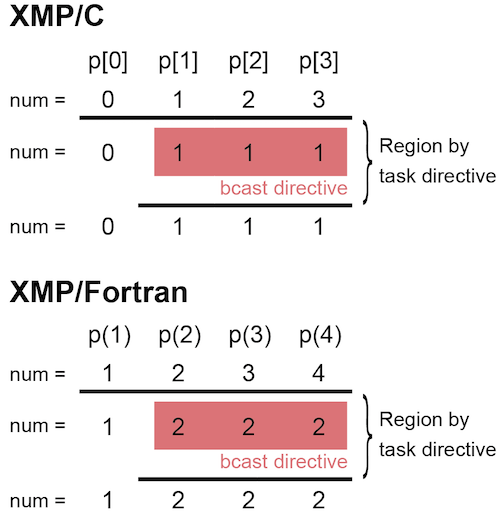
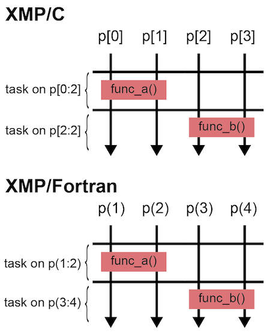

=================================
task/tasks指示文
=================================

task指示文は，範囲指定したノード集合が動作するタスクを生成します．
tasks指示文は，複数のtask指示文を同時並列に実行する場合に用います．
task指示文の例は :doc:`tutorial-global` にもあるので，本ページではそれとは異なる例について説明します．

.. contents::
   :local:
   :depth: 2

task指示文
-------------------------------------
task指示文はon節でノード集合を指定します．

* XMP/Cプログラム

.. code-block:: C

    #include <stdio.h>
    #pragma xmp nodes p[4]

    int main(){
      int num = xmpc_node_num();
    #pragma xmp task on p[1:3]
    {
      printf("%d: Hello\n", num);
    }

      return 0;
    }

* XMP/Fortranプログラム

.. code-block:: Fortran

    program main
    !$xmp nodes p(4)
      integer :: num

      num = xmp_node_num()
    !$xmp task on p(2:4)
      write(*,*) num, ": Hello"
    !$xmp end task

    end program main

上の例では，XMP/Cでは，p[1]・p[2]・p[3]が関数printf()を実行します．
p[1]は「1: Hello」と出力します．
同様に，XMP/ Fortranでは，p(2)・p(3)・p(4)がwrite文を実行します．
p(2)は「2: Hello」と出力します．

task指示文の重要な特徴として，「タスクのために新しいノード集合を作成する」点があります．
その例として，上のプログラムにおいて，task指示文の範囲の中にbcast指示文を挿入してみます．

* XMP/Cプログラム（一部分）

.. code-block:: C

    #pragma xmp task on p[1:3]
    {
    #pragma xmp bcast (num)
    }

* XMP/Fortranプログラム（一部分）

.. code-block:: Fortran

    !$xmp task on p(2:4)
    !$xmp bcast (num)
    !$xmp end task

このbcast指示文は，task指示文によって作成されたノード集合だけで実行されます．
すなわち，XMP/Cでは，p[1]はp[2]とp[3]に値を放送します．
同様に，XMP/Fortranでは，p(2)はp(3)とp(4)に値を放送します．

上のプログラムのbcast指示文は，下記のように新しい部分ノード集合を作成して実行することと同じ意味になります．

* XMP/Cプログラム（一部分）

.. code-block:: C

    #pragma xmp nodes q[3] = p[1:3]
    #pragma xmp bcast (num) on q

* XMP/Fortranプログラム（一部分）

.. code-block:: Fortran

    !$xmp nodes q(3) = p(2:4)
    !$xmp bcast (num) on q

注意点として，task指示文の中では新しいノード集合によって実行されるので，
xmpc_node_num()やxmp_node_num()で取得するノード番号は新しいノード集合に対する番号が返ります．

例えば，一番最初のプログラムにおいて，xmpc_node_num()やxmp_node_num()をtask指示文の範囲の中に挿れてみます．

* XMP/Cプログラム

.. code-block:: C

    #include <stdio.h>
    #pragma xmp nodes p[4]

    int main(){
    #pragma xmp task on p[1:3]
    {
      printf("%d: Hello\n", xmpc_node_num());
    }

      return 0;
    }

* XMP/Fortranプログラム

.. code-block:: Fortran

    program main
    !$xmp nodes p(4)

    !$xmp task on p(2:4)
      write(*,*) xmp_node_num(), ": Hello"
    !$xmp end task

    end program main

XMP/Cでは，p[1]は「0: Hello」と出力します．
同様に，XMP/Fortranでは，p(2)は「1: Hello」と出力します．

.. note::
   task指示文がtasks指示文の中にない場合，task指示文のon節によって新しいノード集合が作成されます．
   この操作は，全ノードが参加している必要があります．
   すなわち，上の例では，XMP/Cではp[0]，XMP/Fortranではp(1)もtask指示文を実行する必要があります．

tasks指示文
----------------
task指示文だけを使って，2種類の関数を2つのノード集合でそれぞれ実行したいとします．

* XMP/Cプログラム

.. code-block:: C

    #pragma xmp nodes p[4]

    #pragma xmp task on p[0:2]
    {
      func_a();
    }
    #pragma xmp task on p[2:2]
    {
      func_b();
    }

* XMP/Fortranプログラム

.. code-block:: Fortran

    !$xmp nodes p(4)
    
    !$xmp task on p(1:2)
      call func_a()
    !$xmp end task
    !$xmp task on p(3:4)
      call func_b()
    !$xmp end task

上の例だと，全ノードはtask指示文の開始位置にあるon節を評価する必要があるため，2つのタスクは並列には実行されません．

複数のタスクを並列実行したい場合は，tasks指示文を用います．

* XMP/Cプログラム

.. code-block:: C

    #pragma xmp nodes p[4]

    #pragma xmp tasks
    {
    #pragma xmp task on p[0:2]
    {
      func_a();
    }
    #pragma xmp task on p[2:2]
    {
      func_b();
    }
    }

* XMP/Fortranプログラム

.. code-block:: Fortran

    !$xmp nodes p(4)

    !$xmp tasks
    !$xmp task on p(1:2)
      call func_a()
    !$xmp end task
    !$xmp task on p(3:4)
      call func_b()
    !$xmp end task
    !$xmp end tasks

task指示文のon節指定されたノード集合に重なりがない場合は，すべてのタスクは並列に実行できます．

.. image:: ../img/task_tasks/tasks.png
