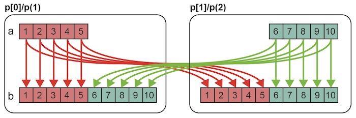

===================================
チュートリアル（Global-view）
===================================

.. contents::
   :local:
   :depth: 2

はじめに
-----------
グローバルビューのプログラミングでは，逐次プログラムに指示文を挿入することで並列化を行います．
グローバルビューでは，下記の動作を指示文を使って記述します．

* データマッピング（データを分割し，各ノードに割り当てる）
* ワークマッピング（処理を分割し，各ノードに割り当てる）
* ノード間通信（ノード間でデータの通信を行う）

本章では，下記のシンプルな逐次プログラムを並列化していくことで，XMPの機能を説明します．

* Cプログラム

.. code-block:: C

    #include <stdio.h>

    int main(){
      int a[10];

      for(int i=0;i<10;i++){
        a[i] = i+1;
        printf("%d\n", a[i]);
      }

      return 0;
    }

* Fortranプログラム

.. code-block:: Fortran

    program main
      integer a(10)
    
      do i=1, 10
        a(i) = i
        write(*,*) a(i)
      enddo
    end program main

このプログラムをgccやgfortranなどの逐次プログラム用のコンパイラで翻訳し，実行すると下記のように1〜10の数字が出力されます．

.. code-block:: bash

    1
    2
    3
    4
    5
    6
    7
    8
    9
    10

では，このプログラムを並列化していきます．

データマッピング
-------------------------------------------------------
データマッピングを行うには，notes指示文，template指示文，distribute指示文，align指示文を用います．
指示文の先頭は，XMP/Cは「#pragma xmp」，XMP/Fortranは「!$xmp」です．

* XMP/Cプログラム（未完成）

.. code-block:: C

    #include <stdio.h>
    
    int main(){
    #pragma xmp nodes p[2]
    #pragma xmp template t[10]
    #pragma xmp distribute t[block] onto p
      int a[10];
    #pragma xmp align a[i] with t[i]

      for(int i=0;i<10;i++){
        a[i] = i+1;
        printf("%d\n", a[i]);
      }

      return 0;
    }

* XMP/Fortranプログラム（未完成）

.. code-block:: Fortran

    program main
    !$xmp nodes p(2)
    !$xmp template t(10)
    !$xmp distribute t(block) onto p
      integer a(10)
    !$xmp align a(i) with t(i)

      do i=1, 10
        a(i) = i
        write(*,*) a(i)
      enddo
    end program main

上の例では，要素数10の配列aを各ノードに5要素ずつ分散配置しています．

nodes指示文はサイズ2のノード集合pを，template指示文はサイズ10のテンプレートtを宣言しています．
XMPでは，角括弧を用いると0からインデックスが始まり，丸括弧を用いると1からインデックスが始まります．
XMP/Cでは，p[0]とp[1]のノードとt[0]からt[9]のテンプレートが宣言されています．
同様に，XMP/Fortranでは，p(1)とp(2)のノードとt(1)からt(10)のテンプレートが宣言されています．

.. note::
    歴史的な経緯により，XMP/Cでも丸括弧を利用できますが，
    各ベース言語に従い，XMP/Cでは角括弧，XMP/Fortranでは丸括弧を用いることをお勧めします．
    なお，XMP/Fortranでは角括弧は利用できません．

distribute指示文は，ノード上にテンプレートを分散させます．
XMP/Cの場合は，p[0]にt[0]からt[4]を対応付け，p[1]にt[5]からt[9]を対応付けます．
同様に，XMP/Fortranの場合は，
p(1)にt(1)からt(5)を対応付け，p(2)にt(6)からt(10)を対応付けます．

align指示文は，指定した配列に対して，テンプレートに設定されたデータマッピングを行います．
align指示文は，配列の宣言より後に挿入します．
XMP/Cの場合は，p[0]にa[0]からa[4]を対応付け，p[1]にa[5]からa[9]を対応付けます．
同様に，XMP/Fortranの場合は，p(1)にa(1)からa(5)を対応付け，p(2)にa(6)からa(10)を対応付けます．

これまでの指示文の動作を図示すると，下記のようになります．

.. image:: ../img/tutorial-global/global.png

align指示文でデータマッピングされた配列を「分散配列」と呼びます．
データマッピングされていない配列（通常の配列）は，全ノードにそのまま存在するので，「重複配列」と呼びます．

ここまでで，データマッピングは完了です．
次に，データマッピングで用いたテンプレートを用いて，ワークマッピングを行っていきます．

ワークマッピング
------------------

loop指示文
^^^^^^^^^^^

ループ文に対してワークマッピングを行うためにloop指示文を用います．
loop指示文は対象のループ文の直前に挿入します．

* XMP/Cプログラム

.. code-block:: C

    #include <stdio.h>

    int main(){
    #pragma xmp nodes p[2]
    #pragma xmp template t[10]
    #pragma xmp distribute t[block] onto p
      int a[10];
    #pragma xmp align a[i] with t[i]

    #pragma xmp loop on t[i]
      for(int i=0;i<10;i++){
        a[i] = i+1;
        printf("%d\n", a[i]);
      }

      return 0;
    }

* XMP/Fortranプログラム

.. code-block:: Fortran

    program main
    !$xmp nodes p(2)
    !$xmp template t(10)
    !$xmp distribute t(block) onto p
      integer a(10)
    !$xmp align a(i) with t(i)

    !$xmp loop on t(i)
      do i=1, 10
        a(i) = i
        write(*,*) a(i)
      enddo
    end program main

上の例では，XMP/Cの場合は，p[0]にイテレーション0から4を対応付け，p[1]に5から9を対応付けます．
同様に，XMP/Fortranの場合は， p(1)にイテレーション1から5を対応付け，p(2)に6から10を対応付けます．

このプログラムをXMPコンパイラを用いて翻訳し，2ノードで実行すると，2つのノードからそれぞれ担当した5要素が出力されます．
例えば以下のような結果となります．

.. code-block:: bash

   1
   2
   3
   4
   5
   6
   7
   8
   9
   10

2つのノードは，どちらが先に実行されるかわからないため，下記のように出力の順番が逆になることや，出力が混じることもあります．

.. code-block:: bash

   6
   7
   8
   9
   10
   1
   2
   3
   4
   5

task指示文
^^^^^^^^^^^
特定のノード集合だけが実行する範囲を設定するtask指示文を紹介します．
XMP/Cの場合はtask指示文の適用範囲は波括弧で記述し，XMP/Fortranの場合は適用範囲の終了をend task指示文で記述します．

* XMP/Cプログラム

.. code-block:: C

    #include <stdio.h>

    int main(){
    #pragma xmp nodes p[2]
    
    #pragma xmp task on p[0]
      {
        printf("Hello\n");
      }
      return 0;
    }

* XMP/Fortranプログラム

.. code-block:: Fortran

    program main
    !$xmp nodes p(2)

    !$xmp task on p(1)
      write(*,*) "Hello"
    !$xmp end task
    end program main

この例では，XMP/Cの場合はp[0]，XMP/Fortranの場合はp(1)のそれぞれ1ノードだけが"Hello"と出力します．

次に，複数のノードを指定する方法を説明します．
XMPでは「triplet」という下記の記法を用いることで，複数のノードを指定できます．

* XMP/Cプログラム

.. code-block:: C

    [start:length:stride]

* XMP/Fortranプログラム

.. code-block:: Fortran

    (start:end:stride)

この記法はFortranでは一般に利用されているものなので，以下ではXMP/Cにおけるtripletについて説明します．

ノード集合pが定義されている場合，p[0:5]はp[0]からp[4]の5ノードを意味します．
コロン前の数字は開始番号，コロン後の数字は要素数を意味します．
開始番号および要素数は省略できます．
開始番号を省略した場合，開始番号には0が用いられます．
要素数を省略した場合，要素数には開始番号から計算できる残りの要素数が用いられます．
また，p[0:5:2]のようにコロンが2つ用いられた場合は，2つ目のコロンの後の数字はステップ数を指します．
p[0:5:2]はp[0]から2ステップごとに5要素という意味になります．

20ノードで構成されるノード集合pに対するtripletの例を下記に示します．

+-----------+------------------------------------------------+
| 表記      | 意味                                           |
+===========+================================================+
| p[5:10]   | p[5]からp[14]までの10ノード                    |
+-----------+------------------------------------------------+
| p[:10]    | p[0]からp[9]までの10ノード                     |
+-----------+------------------------------------------------+
| p[10:]    | p[10]からp[19]までの10ノード                   |
+-----------+------------------------------------------------+
| p[:]      | すべてのノード（p[0]からp[19]までの20ノード）  |
+-----------+------------------------------------------------+
| p[0:5:2]  | p[0]，p[2]，p[4]，p[6]，p[8]の5ノード          |
+-----------+------------------------------------------------+

.. note:: 

    Fortranの場合，1つ目のコロン後の数字は「終了番号」を指します．

この記法を用いて，例えば4ノードで構成されるノード集合から最初の2ノードだけで実行したい場合は，下記のようにtask指示文のon節にノード集合を指定します．

* XMP/Cプログラム

.. code-block:: C

    #include <stdio.h>

    int main(){
    #pragma xmp nodes p[4]
    
    #pragma xmp task on p[0:2]
      {
        printf("Hello\n");
      }
      return 0;
    }

* XMP/Fortranプログラム

.. code-block:: Fortran

    program main
    !$xmp nodes p(4)

    !$xmp task on p(1:2)
      write(*,*) "Hello"
    !$xmp end task
    end program main

ノード間通信
-----------------
最終的な答えを1つのノードに集約して出力することを行います．

* XMP/Cプログラム

.. code-block:: C

    #include <stdio.h>

    int main(){
    #pragma xmp nodes p[2]
    #pragma xmp template t[10]
    #pragma xmp distribute t[block] onto p
      int a[10], b[10];
    #pragma xmp align a[i] with t[i]

    #pragma xmp loop on t[i]
      for(int i=0;i<10;i++){
        a[i] = i+1;
      }

    #pragma xmp gmove
      b[:] = a[:];

    #pragma xmp task on p[0]
    {
      for(int i=0;i<10;i++)
        printf("%d\n", b[i]);
    }

      return 0;
    }
    
* XMP/Fortranプログラム

.. code-block:: Fortran

    program main
    !$xmp nodes p(2)
    !$xmp template t(10)
    !$xmp distribute t(block) onto p
      integer a(10), b(10)
    !$xmp align a(i) with t(i)

    !$xmp loop on t(i)
      do i=1, 10
        a(i) = i
      enddo

    !$xmp gmove
      b(:) = a(:)

    !$xmp task on p(1)
      do i=1, 10
        write(*,*) b(i)
      enddo
    !$xmp end task
    end program main

配列aと同じ型と形状を持つ重複配列bを宣言します．
上のプログラムでは，gmove指示文を用いて配列aの全要素を配列bに集め，
task指示文を用いて1ノードだけが配列bの出力を行っています．

gmove指示文は，分散配列に対して通信を行うための指示文です．
gmove指示文は，その後に続く配列代入文とセットで用います．
配列代入文ではtripletを用いることで，複数の要素を表現できます．
この例では，分散配列aの全要素から重複配列bの全要素への通信を表現していて，下図ような通信パターンとなります．

配列bと同じインデックスを持つ配列aの要素についてはノード内の通信が行われ，
配列bと異なるインデックスを持つ配列aの要素についてはノード間の通信が行われます．

出力結果は下記のようになります．XMP/Cではp[0]，XMP/Fortranではp(1)のそれぞれ1ノードだけが，出力を行っています．
この出力は，1ノードだけが実行しているので，順番通りに値が出力されます．

.. code-block:: bash

    1
    2
    3
    4
    5
    6
    7
    8
    9
    10

以上で，XMPによる並列化は完了です，

.. note::

    XMPではノード間の通信はすべて明示的に記述する必要があります．
    XMPコンパイラは，XMPの記述から適切な通信を生成しますが，
    記述がない箇所では通信を生成することはありません（この点がXMPの先祖であるHPFとの大きな違いです）．
    このような仕様にした理由は，利用者が予想しない箇所で通信が起こった場合，
    プログラムの性能チューニングが難しくなるためです．
    通信は利用者が記述した場所だけで発生し，記述のない場所は全実行ノードが同じ実行を行う冗長実行となります．

