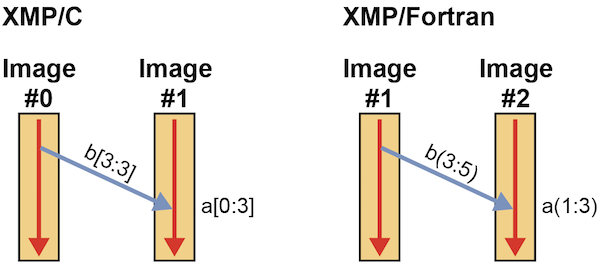
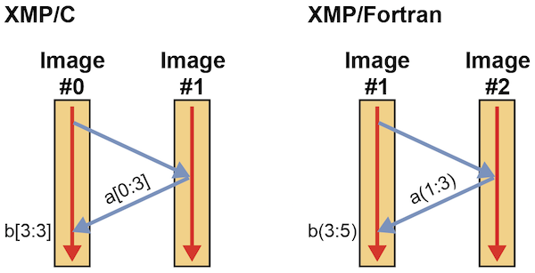
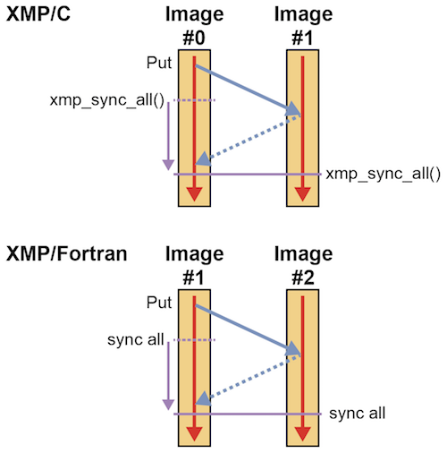

=================================
チュートリアル（Local-view）
=================================

.. contents::
   :local:
   :depth: 2

はじめに
-----------
ローカルビューのプログラミングでは，Coarrayによる片側通信記法を用いて並列化を行います．
片側通信とは，いわゆるPut通信とGet通信のことであり，
ローカルビューではその片側通信に対応する同期のための記法も提供しています．

片側通信はハードウェアのRemote Direct Memory Access（RDMA）機能と親和性が高いため，
グローバルビューよりも高い性能のアプリケーションを作成できる場合があります．
その代わり，個々のノードの振る舞いを記述する必要があるため，
グローバルビューよりもプログラミングがやや難しくなるかもしれません．

Fortranの標準規格であるFortran 2008で採用されたCoarrayをXMP/Fortranでも採用しています．
C言語の標準規格にはCoarrayに類するものはないので，
XMP/CにおけるCoarrayはXMP独自のものとなっています．

.. note:: XMP/FortranはFortran 2008の上位互換となっています．

グローバルビューでは実行単位のことをノードと呼びますが，
ローカルビューではFortran 2008に従い「イメージ」と呼びます．
この2つは，XMPでは同じ意味で用います．

Coarrayの宣言
---------------
早速，Coarrayを宣言してみましょう．

* XMP/Cプログラム

.. code-block:: C

    int a[10]:[*];

* XMP/Fortranプログラム

.. code-block:: Fortran

   integer a(10)[*]

XMP/Cでは，通常の配列の後ろにコロンと角括弧を用いて配列を宣言します．
XMP/Fortranでは，通常の配列の後ろに角括弧を用いて配列を宣言します．
両言語とも，角括弧の中にはアスタリスクを記述します．

.. note::
    Fortran 2008の仕様上，全イメージで同じ型と形状のCoarrayを宣言しないといけません．

Coarrayとして宣言された配列は，代入文を用いて他のイメージからアクセスすることができます．
もちろん，自イメージから通常の配列のようにアクセスすることもできます．

片側通信
---------
Put通信
^^^^^^^^^

Put通信を発生させるには，左辺にCoarrayを記述します．

* XMP/Cプログラム

.. code-block:: C

    int a[10]:[*], b[10];
    
    if (xmpc_this_image() == 0)
      a[0:3]:[1] = b[3:3];

* XMP/Fortranプログラム

.. code-block:: Fortran

   integer a(10)[*]
   integer b(10)

   if (this_image() == 1) then
     a(1:3)[2] = b(3:5)
   end if

左辺の角括弧内の番号はイメージ番号です．
イメージ番号は，XMP/Cでは0から始まり，XMP/Fortranでは1から始まります．
XMP/Cのxmpc_this_image()とXMP/Fortranのthis_image()はイメージ番号を返す関数です．

.. note::
   XMP/Fortranではイメージ番号を指定するために角括弧を用いていますが，Fortran 2008の仕様に従い，イメージのインデックスは1から始まります．

.. note::
   両辺が角括弧つきのCoarrayの場合，いわゆる三角通信が発生します．イメージAがイメージBの持っているデータをイメージCに渡すといった通信パターンです．

上のプログラムにおいて，XMP/Cでは，イメージ0はb[3]からb[5]の3要素をイメージ1の配列aの先頭にPutしています．
同様に，XMP/Fortranでは，イメージ1はb(3)からb(5)の3要素をイメージ2の配列aの先頭にPutしています．

.. note::
   指示文を用いるグローバルビューでは，送信側と受取側の両方のノードが通信の発行を行いますが，
   Coarrayを用いるローカルビューでは，通信の起点となるイメージのみが通信の発行を行います．

Get通信
^^^^^^^^^
Get通信を発生させるには，右辺にCoarrayを記述します．

* XMP/Cプログラム

.. code-block:: C

    int a[10]:[*], b[10];

    if (xmpc_this_image() == 0)
      b[3:3] = a[0:3]:[1];

* XMP/Fortranプログラム

.. code-block:: Fortran

   integer a(10)[*]
   integer b(10)

   if (this_image() == 1) then
     b(3:5) = a(1:3)[2]
   end if

上のプログラムにおいて，XMP/Cでは，イメージ0はイメージ1が持っている配列aの先頭から3要素をb[3]からb[5]にGetしています．
同様に，XMP/Fortranでは，イメージ1はイメージ2が持っている配列aの先頭から3要素をb(3)からb(5)にGetしています．

.. hint::
   図を見てわかる通り，GetはPutと比較して，相手イメージにデータ送信を命令する手順が追加で必要になります．
   そのため，PutはGetよりも性能が高い場合があります．

同期
---------
同期のための命令はいくつかありますが，ここでは最も利用頻度が高いと考えられるsync allを紹介します．

* XMP/Cプログラム

.. code-block:: C

    void xmp_sync_all(int *status)

* XMP/Fortranプログラム

.. code-block:: Fortran

    sync all

これまでに発行したすべての片側通信の完了を待ち，さらにバリア同期を行います．
バリア同期なので，すべてのイメージで実行する必要があります．

上の例では，左のイメージがPutしたデータが右のイメージに書き込まれ，
さらに両方のイメージがsync allを実行した後，sync allが終了することを示しています．

実習
----------
下記のサンプルを2イメージで実行してみましょう．

* XMP/Cプログラム

.. code-block:: C

   #include <stdio.h>
   #include <xmp.h>
   int a[10]:[*], b[10]:[*], c[10][10]:[*];
   
   int main(){
     int me = xmpc_this_image();
   
     for(int i=0;i<10;i++)
       a[i] = b[i] = i + 10 * me;
   
     for(int i=0;i<10;i++)
       for(int j=0;j<10;j++)
         c[i][j] = (i * 10 + j) + 100 * me;
   
     xmp_sync_all(NULL);
    
     if(xmpc_this_image() == 0){
       a[0:3] = a[5:3]:[1];            // Get
       for(int i=0;i<10;i++)
         printf("%d\n", a[i]);
   
       b[0:5:2] = b[0:5:2]:[1];       // Get
       printf("\n");
       for(int i=0;i<10;i++)
         printf("%d\n", b[i]);
   
       c[0:5][0:5]:[1] = c[0:5][0:5]; // Put
     }
     xmp_sync_all(NULL);
   
     if(xmpc_this_image() == 1){
       printf("\n");
       for(int i=0;i<10;i++){
         for(int j=0;j<10;j++){
         printf("  %3d",c[i][j]);
         }
         printf("\n");
       }
     }
   
     return 0;
   }

* XMP/Fortranプログラム

.. code-block:: Fortran

   program main
     implicit none
     include "xmp_coarray.h"
     integer :: a(10)[*], b(10)[*], c(10,10)[*]
     integer :: i, j, me
   
     me = this_image()
   
     do i=1, 10
       b(i) = (i-1) + 10 * (me - 1)
       a(i) = b(i)
     end do
   
     do i=1, 10
       do j=1, 10
         c(j,i) = ((i-1) * 10 + (j-1)) + 100 * (me - 1)
       end do
     end do
     
     sync all
   
     if (this_image() == 1) then
       a(1:3) = a(6:8)[2] ! Get
       do i=1, 10
         write(*,*) a(i)
       end do
     
       b(1:10:2) = b(1:10:2)[2];  ! Get
       write(*,*) ""
       do i=1, 10
         write(*,*) b(i)
       end do
   
       c(1:5,1:5)[2] = c(1:5,1:5) ! Put
     end if
   
     sync all
   
     if (this_image() == 2) then
       write(*,*) ""
       do i=1, 10
         write(*,*) c(:,i)
       end do
     end if
   end program main
 
上のプログラムでは，3つのCoarrayであるa，b，cを宣言しています．
aとbは1次元配列であるのに対し，cは2次元配列です．
それぞれの配列の初期値は，下記の通りです．

* XMP/Cのイメージ0，XMP/Fortranのイメージ1
   * a : 0から9
   * b : 0から9
   * c : 0から99
* XMP/Cのイメージ1，XMP/Fortranのイメージ2
   * a : 10から19
   * b : 10から19
   * c : 100から199

連続領域の片側通信
^^^^^^^^^^^^^^^^^^^^^
最初のGetにおいて，XMP/Cでは，イメージ0はイメージ1が持つ配列a[5]から3要素を配列aの先頭にGetしています．
同様に，XMP/Fortranでは，イメージ1はイメージ2が持つ配列a(6)から3要素を配列aの先頭にGetしています．

Get終了後の配列aは，下記のようになります．

.. code-block:: bash

  15
  16
  17
  3
  4
  5
  6
  7
  8
  9

ステップ毎の片側通信
^^^^^^^^^^^^^^^^^^^^^
2つ目のGetにおいて，XMP/Cでは，イメージ0はイメージ1が持つ配列bの先頭から5要素を2ステップ毎に配列bの同じ位置にGetしています．
同様に，XMP/Fortranでは，イメージ1はイメージ2が持つ配列bの先頭から5要素を2ステップ毎に配列bの同じ位置にGetしています．

Get終了後の配列bは，下記のようになります．

.. code-block:: bash
  
  10
  1
  12
  3
  14
  5
  16
  7
  18
  9

多次元配列の片側通信
^^^^^^^^^^^^^^^^^^^^^
最後のPutにおいて，XMP/Cでは，イメージ0は配列c[0:5][0:5]の25要素をイメージ1の同じ位置にPutしています．
同様に，XMP/Fortranでは，イメージ1は配列c(1:5,1:5)の25要素をイメージ2の同じ位置にPutしています．
この通信パターンは，ブロックストライド通信になります．

Put終了後の配列cは，下記のようになります．

.. code-block:: bash

    0    1    2    3    4  105  106  107  108  109
   10   11   12   13   14  115  116  117  118  119
   20   21   22   23   24  125  126  127  128  129
   30   31   32   33   34  135  136  137  138  139
   40   41   42   43   44  145  146  147  148  149
  150  151  152  153  154  155  156  157  158  159
  160  161  162  163  164  165  166  167  168  169
  170  171  172  173  174  175  176  177  178  179
  180  181  182  183  184  185  186  187  188  189
  190  191  192  193  194  195  196  197  198  199

